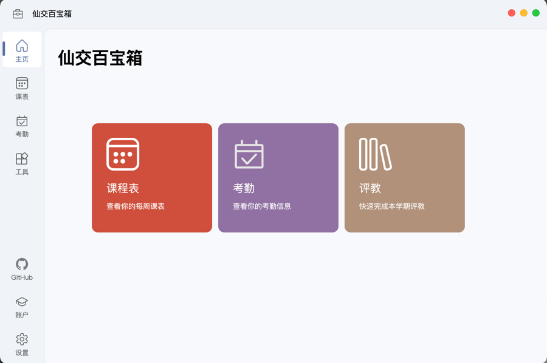
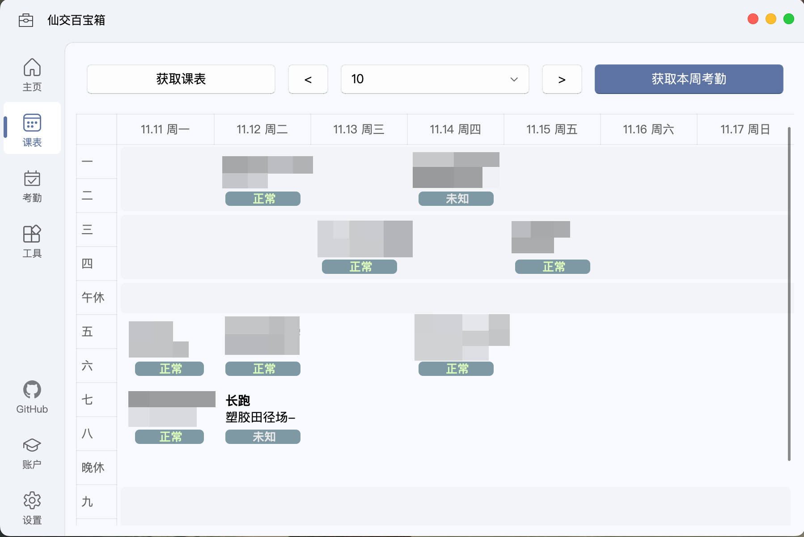

# 仙交百宝箱·XJTUToolbox

基于 PyQt5 的桌面端工具，帮助您一站式解决交大生活的各种需求

## 功能简介
- 多账户支持：支持登录多个账户，一键切换账户，方便查看多个账户的信息
- 本地账户加密：支持加密本地存储的账户信息，保护您的隐私
- 一键评教：利用预先定义的选项模版，一键完成评教问卷
- 考勤查询：查询整学期的考勤流水
- 课表查询：查询整学期的课表，并查看每节课程的考勤信息
- 成绩查询：查询多个学期的成绩，平均分，自选课程计算绩点
- 通知订阅：订阅教务处、各个学院的消息，设置定时推送，快速查看网站的新通知

如果遇到问题或有新功能建议，请在 [Issue](https://github.com/yan-xiaoo/XJTUToolBox/issues) 中提出

如果你解决了某个问题或添加了新的功能，欢迎提出 PR。

## 界面展示

## 下载安装
你可以从 [Release](https://github.com/yan-xiaoo/XJTUToolBox/releases) 页面下载最新版本的安装包。

使用 GNU/Linux 发行版的用户请参考「源码运行」部分，通过克隆源代码运行程序。

> 本项目的二进制安装包全部由 Github Actions 直接从源代码生成，请放心使用

下载后，Windows 用户可以将压缩文件解压到某个文件夹中，点击其中的「XJTUToolbox.exe」启动程序。请不要删除文件夹中的任何内容，否则程序可能无法启动。

macOS 用户需要将应用程序拖到访达侧栏的「应用程序」文件夹内，否则无法正常运行。打开应用时，**如果提示「无法验证此 app 的开发者」，请打开设置程序，在「隐私与安全性」部分中下拉，找到「无法验证 xxx 的开发者」一栏信息，点击右侧的「仍要打开」。**

> 这是因为 macOS 会检查从网络下载的应用程序的签名，而我目前负担不起向 Apple 支付开发者账户的费用，因此无法签名。

你可以通过设置-关于-检查更新来检查是否有新版本。在 Windows 上，程序可以自动覆盖更新；在 macOS 上，由于代码签名问题，你需要手动解压下载后的新版本应用，并手动覆盖旧版本应用。

如果喜欢本项目，就给一颗星星吧✨

## 源码运行
如果你不想研究/修改/协助开发此软件的话，请直接选择上面的安装方式，避免不必要的麻烦
> 请尽量使用 venv 或者 miniconda 等虚拟环境安装依赖

- 安装 Python 3.12 或以上版本。更低版本的 Python 可能可以运行本程序，但可能存在兼容性问题
- 克隆本项目：`git clone https://github.com/yan-xiaoo/XJTUToolBox.git`
- 安装依赖库：
  - macOS 系统用户：`pip install -r requirements_osx.txt` 或 `pip install -i https://pypi.tuna.tsinghua.edu.cn/simple -r requirements_osx.txt` （国内）
  - 其他系统用户：`pip install -r requirements.txt` 或 `pip install -i https://pypi.tuna.tsinghua.edu.cn/simple -r requirements.txt` （国内）
  > macOS 系统中，由于 PyCocoa 和 pyobjc 最新版本出现冲突，必须手动限制 pyobjc 的版本
- 运行：`python app.py`

> 从源码运行时，macOS 系统的用户需要额外安装 pyobjus 库以实现通知发送。如果不安装，定时推送通知功能将无法使用。
> 
> 由于依赖库还没有在 pypi 上更新最新的版本，你需要手动编译安装最新的源代码版本。请在存放本软件的终端下依次执行以下命令：
> 
> `git clone https://github.com/kivy/pyobjus.git`
> 
> `pip install Cython==3.0.12`
> 
> `cd pyobjus`
> 
> `make build_ext`
> 
> `python setup.py install`

更新代码：
- `git pull`

## 未来规划
- 考勤统计查询：查询整学期课程的考勤状态，快速找出缺勤的课程

## 开发相关
项目结构说明：
- app 目录下存放图形界面的相关代码
- attendance, ehall, schedule, auth 四个目录的代码实现了一部分西交的 API，与图形界面逻辑无关，可以在此基础上开发其他项目
> auth: 西交登录、WebVPN 登录相关代码
>
> ehall: Ehall 系统的相关代码，包含评教接口，课表接口和成绩接口
> 
> schedule: 课表类型定义代码，不包含接口
> 
> attendance: 考勤系统相关代码，包含考勤查询、课表查询接口
> 
> jwapp：移动教务相关代码，包含成绩查询接口（项目中暂未使用）

## 相关项目与致谢
本项目的完成离不开如下开源项目的帮助：
- [qfluentwidgets (PyQt5 界面库)](https://github.com/zhiyiYo/PyQt-Fluent-Widgets)
- [better-ehall (交大登录示例项目)](https://github.com/guitaoliu/xjtu-grade)
- [webvpn-dlut (WebVPN 网址转换)](https://github.com/ESWZY/webvpn-dlut)
- [xidian-script（Ehall 开发实例）](https://github.com/xdlinux/xidian-scripts)
- [chine-holiday-calendar（节假日日历接口）](https://github.com/lanceliao/china-holiday-calender)
- [holiday-cn（另一个节假日接口）](https://github.com/NateScarlet/holiday-cn)