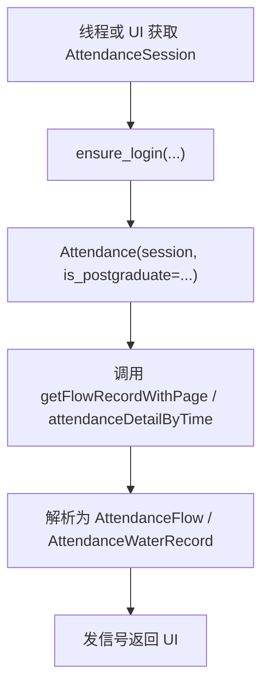

# 考勤系统模块

`attendance` 模块封装西安交通大学考勤系统接口，提供考勤系统登录、考勤流水查询、课程考勤状态查询和考勤系统课表查询能力。GUI 中的“考勤流水”页面和“课表与考勤”页面都会使用这个模块。

本科生与研究生考勤系统接口结构基本一致，但部署在不同域名下。模块通过 `is_postgraduate` 参数选择访问本科生或研究生系统。

## 模块职责

考勤模块支持以下能力：

- 本科生考勤系统访问。
- 研究生考勤系统访问。
- 普通访问与 WebVPN 访问。
- 用户名密码登录与二维码登录。
- 登录后提取并维护 `Synjones-Auth` header。
- 查询刷卡流水。
- 查询课程维度的考勤状态。
- 查询考勤系统中的课表数据。

## 代码位置

| 文件 | 职责 |
| --- | --- |
| `attendance/attendance.py` | 考勤系统登录类、数据结构、API 封装 |
| `app/sessions/attendance_session.py` | GUI 层考勤站点 Session |
| `app/threads/AttendanceFlowThread.py` | 考勤流水查询线程 |
| `app/threads/ScheduleAttendanceThread.py` | 课表界面中的考勤查询线程 |
| `app/threads/ScheduleAttendanceMonitorThread.py` | 考勤查询监视线程 |
| `app/AttendanceInterface.py` | “考勤流水”主界面 |
| `app/ScheduleInterface.py` | “课表与考勤”界面中的考勤集成 |

## 系统入口与域名

考勤系统按用户类型分为两个站点：

| 用户类型 | 普通访问域名 | WebVPN 入口常量 |
| --- | --- | --- |
| 本科生 | `bkkq.xjtu.edu.cn` | `ATTENDANCE_WEBVPN_URL` |
| 研究生 | `yjskq.xjtu.edu.cn` | `POSTGRADUATE_ATTENDANCE_WEBVPN_URL` |

`Attendance` 类中的 `_build_url()` 会根据 `is_postgraduate` 选择域名，并把接口路径拼接为完整 URL。新增 API 方法时，应继续使用 `_get()` / `_post()` 访问接口，让域名选择、HTTP 错误处理保持一致。

## 登录与 Synjones-Auth

考勤系统完成统一认证后，还需要在后续请求中携带 `Synjones-Auth` header。模块通过专用登录类提取 token 并写入 session headers。

| 登录类 | 访问方式 | 二维码 |
| --- | --- | --- |
| `AttendanceNewLogin` | 普通访问 | 否 |
| `AttendanceNewWebVPNLogin` | WebVPN | 否 |
| `AttendanceNewQRCodeLogin` | 普通访问 | 是 |
| `AttendanceNewWebVPNQRCodeLogin` | WebVPN | 是 |

这些登录类复用 `auth` 模块的统一认证状态机。普通登录类继承 `NewLogin`，WebVPN 登录类继承 `NewWebVPNLogin`，二维码登录类通过 `QRCodeLoginMixin` 复用扫码登录流程。

考勤系统的 token 提取逻辑位于 `postLogin()`：

1. 统一认证完成后进入考勤系统入口。
2. 从最终跳转 URL 中读取 `token` 参数。
3. 写入 `self.session.headers["Synjones-Auth"]`。

这个 header 是 `AttendanceSession.validate_login()` 判断考勤站点状态的前置条件，也是后续所有考勤接口请求的认证凭据。

## AttendanceSession

GUI 程序通过 `AttendanceSession` 接入 Session 管理层。它的关键配置如下：

| 字段 | 值 | 含义 |
| --- | --- | --- |
| `site_key` | `attendance` | SessionManager 中的注册名称 |
| `site_name` | `考勤系统` | 展示给用户的站点名称 |
| `supports_webvpn` | `True` | 支持 WebVPN 访问 |
| `use_webvpn_when_off_campus` | `True` | 自动探测为校外时使用 WebVPN |

`AttendanceSession._login()` 会根据当前访问方式选择登录类：

- `AccessMode.NORMAL`：使用 `AttendanceNewLogin` 或 `AttendanceNewQRCodeLogin`。
- `AccessMode.WEBVPN`：使用 `AttendanceNewWebVPNLogin` 或 `AttendanceNewWebVPNQRCodeLogin`。

同时，它会根据账号类型选择统一认证身份：

- 本科生账号使用 `NewLogin.UNDERGRADUATE`。
- 研究生账号使用 `NewLogin.POSTGRADUATE`。

`validate_login()` 使用 `/attendance-student/global/getStuInfo` 验证登录态。它会先检查 `Synjones-Auth` 是否存在，再访问当前账号类型对应的考勤系统域名。

## 核心数据结构

考勤模块定义了两类状态枚举和两类数据对象。

| 类型 | 含义 |
| --- | --- |
| `FlowRecordType` | 刷卡流水状态 |
| `WaterType` | 已结束课程的考勤状态 |
| `AttendanceFlow` | 一条刷卡流水 |
| `AttendanceWaterRecord` | 一节课的考勤结果 |

`FlowRecordType` 包含：

| 枚举 | 含义 |
| --- | --- |
| `VALID` | 有效刷卡 |
| `INVALID` | 无效刷卡 |
| `REPEATED` | 重复刷卡 |
| `UNKNOWN` | 未知状态 |

`WaterType` 包含：

| 枚举 | 含义 |
| --- | --- |
| `NORMAL` | 正常 |
| `LATE` | 迟到 |
| `ABSENCE` | 缺勤 |
| `EARLY_LEAVE` | 早退 |
| `LEAVE` | 请假 |

`AttendanceFlow` 的关键字段：

| 字段 | 含义 |
| --- | --- |
| `sbh` | 流水编号 |
| `place` | 刷卡地点 |
| `water_time` | 刷卡时间 |
| `type_` | 刷卡状态 |

`AttendanceWaterRecord` 的关键字段：

| 字段 | 含义 |
| --- | --- |
| `sbh` | 考勤记录编号 |
| `term_string` | 学期字符串 |
| `start_time` / `end_time` | 起止节次 |
| `week` | 周数 |
| `location` | 上课地点 |
| `teacher` | 教师 |
| `status` | 课程考勤状态 |
| `date` | 上课日期 |

## 课程考勤状态与考勤流水

考勤模块里有两类容易混淆的数据：课程考勤状态和考勤流水。

| 类型 | 数据结构 | 代表问题 | 适合用途 | 与课程绑定 |
| --- | --- | --- | --- | --- |
| 课程考勤状态 | `AttendanceWaterRecord` | 这节课最终算正常、迟到、缺勤、早退还是请假 | 课表考勤标记、课程维度统计 | 较容易 |
| 考勤流水 | `AttendanceFlow` | 我什么时候在哪个教室刷过卡，刷卡是否有效 | 考勤流水页面、确认是否打卡 | 较困难 |

课程考勤状态来自 `attendanceDetailByTime()`。它包含周数、节次、地点、教师、日期和最终考勤状态，因此可以较自然地绑定到课表中的某节课上。`ScheduleAttendanceThread` 会使用这类数据为课表更新考勤状态。

考勤流水来自 `getFlowRecordWithPage()`、`getFlowRecord()` 或 `getFlowRecordByTime()`。它表示刷卡行为本身，适合回答“有没有刷卡、什么时候刷卡、在哪个教室刷卡、刷卡是否有效”。流水记录和课程的关联信息较少，直接绑定到某节课上需要额外推断。

如果功能需要把考勤结果显示到课表格子上，优先使用 `attendanceDetailByTime()` 返回的 `AttendanceWaterRecord`。如果功能需要展示刷卡历史或分页查询流水，使用 `getFlowRecordWithPage()` / `getFlowRecordByTime()` 返回的 `AttendanceFlow`。

## Attendance API 封装

`Attendance` 类是考勤系统 API 包装器。它接收一个已经登录考勤系统的 session，并根据 `is_postgraduate` 选择本科生或研究生域名。

学生与学期：

| 方法 | 用途 |
| --- | --- |
| `getStudentInfo()` | 获取当前登录学生信息 |
| `getNearTerm()` | 获取当前学期信息 |
| `getTermNoMap()` | 获取学期字符串到考勤系统学期编号的映射 |

考勤统计：

| 方法 | 用途 |
| --- | --- |
| `attendanceCurrentWeek()` | 获取当前周课程考勤统计 |
| `attendanceByTime(start_date, end_date)` | 获取时间段内按课程聚合的考勤统计 |
| `attendanceNumberByTime(start_date, end_date)` | 获取时间段内全部课程考勤总数 |
| `attendanceDetailByTime(start_date, end_date, current, page_size, termNo)` | 获取时间段内课程考勤状态详情 |

课表：

| 方法 | 用途 |
| --- | --- |
| `getWeekSchedule(week, termNo)` | 获取某一周课表 |
| `getSchedule(termNo)` | 获取整个学期课表 |

考勤流水：

| 方法 | 用途 |
| --- | --- |
| `getFlowRecordWithPage(current, page_size)` | 分页获取流水，并返回总数、页码等信息 |
| `getFlowRecord(current, page_size)` | 获取流水列表 |
| `getFlowRecordByTime(start_date, end_date)` | 按日期范围获取流水列表 |

接口返回 `success == False` 时，方法会抛出 `ServerError`。HTTP 状态错误由 `_get()` / `_post()` 中的 `raise_for_status()` 抛出。

## 典型调用流程

GUI 线程通常通过当前账号的 `SessionManager` 获取考勤站点 Session，再创建 `Attendance` API 包装器。



简化代码示例：

```python
from attendance import Attendance

session = account.session_manager.get_session("attendance")
session.ensure_login(
    account.username,
    account.password,
    is_postgraduate=account.type == account.POSTGRADUATE,
    account=account,
)

util = Attendance(
    session,
    is_postgraduate=account.type == account.POSTGRADUATE,
)
records = util.getFlowRecordWithPage(1, 10)
```

`Attendance` 对象是轻量 API 包装器。调用时应按当前 session 和账号类型重新创建，避免旧包装器与新的登录状态不一致。

## 与线程层的关系

考勤模块在 GUI 中主要由三个线程使用：

| 线程 | 用途 |
| --- | --- |
| `AttendanceFlowThread` | 独立“考勤流水”页面分页查询 |
| `ScheduleAttendanceThread` | 课表页面查询一段日期内的考勤流水和课程考勤 |
| `ScheduleAttendanceMonitorThread` | 监视长时间考勤查询，允许用户提前取消并保留部分结果 |

`AttendanceFlowThread` 的流程：

1. 使用当前账号获取 `AttendanceSession`。
2. 调用 `ensure_login()` 确保考勤系统已登录。
3. 创建 `Attendance` 包装器。
4. 调用 `getFlowRecordWithPage()` 查询分页流水。
5. 通过 `flowRecord` 信号返回 UI。

`ScheduleAttendanceThread` 的流程：

1. 确认当前账号和日期范围。
2. 验证或登录考勤系统。
3. 查询考勤流水。
4. 查询课程考勤状态详情。
5. 通过 `result(records, water_page)` 返回课程状态和流水。

`ScheduleAttendanceMonitorThread` 用于处理考勤流水接口响应慢的场景。它监视 `ScheduleAttendanceThread`，在查询时间较长时提示用户可以取消，并在被监视线程强制结束后尽量返回已获得的部分结果。

## 与 UI 层的关系

当前有两个 UI 入口使用考勤模块。

`AttendanceInterface` 是独立考勤流水页面。它创建 `AttendanceFlowThread`，接收 `flowRecord` 后把 `AttendanceFlow` 列表显示到表格中。表格中会将 `FlowRecordType` 映射为“有效”“无效”“重复”“未知”。

`ScheduleInterface` 在课表页面中集成考勤能力。它创建 `ScheduleAttendanceThread` 和 `ScheduleAttendanceMonitorThread`，接收 `AttendanceWaterRecord` 与 `AttendanceFlow` 后，把课程考勤结果合并到课表显示和本地课表数据库状态中。

## 自动重试与取消

考勤系统部分接口响应较慢或偶发返回异常。当前实现中，`cfg.autoRetryAttendance` 控制部分查询失败后的自动重试行为。

自动重试主要捕获：

- `ServerError`
- `json.JSONDecodeError`
- `requests.Timeout`

`AttendanceFlowThread` 查询流水失败时，会在开启自动重试后等待 2 秒继续查询。`ScheduleAttendanceThread` 查询考勤流水失败时，也会按同一配置重试。

课表页面的考勤查询还配有监视线程。监视线程会在流水查询完成后开始计时，如果后续课程考勤查询等待较久，就更新进度提示并缩短取消等待时间。用户取消后，如果已有流水或课程状态结果，监视线程会把已有部分返回给 UI。

## 维护注意事项

- 考勤系统依赖 `Synjones-Auth`，登录后 header 丢失会导致验证失败。
- 本科生和研究生域名不同，新增接口时通过 `_build_url()` 拼接地址。
- 新增 API 方法时统一检查 `result["success"]`，失败时抛出 `ServerError`。
- 日期参数通常使用 `%Y-%m-%d`，部分接口可接受 `%Y-%m-%d %H:%M:%S`。
- 课程维度结果优先解析为 `AttendanceWaterRecord`。
- 刷卡流水结果优先解析为 `AttendanceFlow`。
- WebVPN 访问方式由 `AttendanceSession` 和 `CommonLoginSession` 处理，API 方法保持接口路径和普通域名逻辑。
- 线程中调用接口时，通过 `ProcessThread` 信号反馈进度、错误和结果。

## 已知限制

- 考勤系统接口有时响应较慢。
- 考勤流水接口返回的总页数信息不可靠，当前实现根据 `totalCount` 和 `page_size` 重新计算。
- 部分字段命名来自学校接口，含义按当前功能使用场景解释。
- 考勤系统登录态和 `Synjones-Auth` 有时效，调用前应通过 `AttendanceSession.ensure_login()` 确认。

## 继续阅读

- [认证与登录系统](./auth)：统一认证与 `postLogin()` 扩展点。
- [Session 管理设计](./session)：`AttendanceSession` 如何复用登录态和选择 WebVPN。
- [子线程与进度反馈设计](./thread)：考勤查询线程如何向 GUI 汇报进度。
- [考勤流水用户手册](../tutorial/attendance)：用户视角的考勤流水功能。
- [课表与考勤用户手册](../tutorial/schedule)：用户视角的课表与考勤功能。
