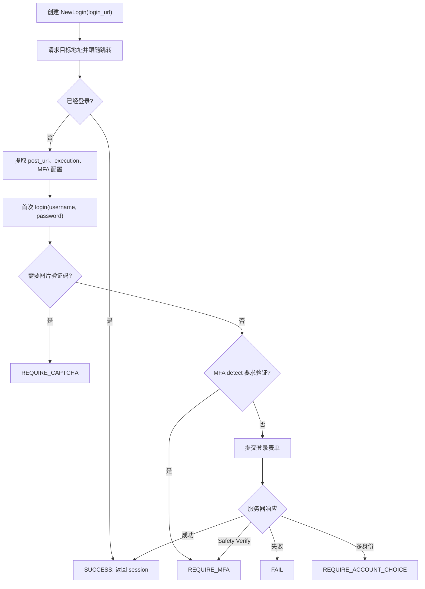

# 认证与登录系统

`auth` 模块封装西安交通大学统一身份认证、WebVPN 网址转换与扫码登录能力。它的核心任务是从一个会触发统一认证的目标地址出发，推进登录流程，并最终得到一个已经认证的 `requests.Session`。

当前登录实现以 `auth/new_login.py` 与 `auth/new_qrcode_login.py` 为准。本页聚焦当前登录链路；历史实现 `auth/login.py` 仅作为旧代码保留。

## 职责边界

认证层只处理统一认证流程本身。账号管理、GUI 弹窗、站点 Session 复用、登录态持久化与后台保活位于应用层。

| 层次 | 代码位置 | 职责 |
| --- | --- | --- |
| 统一认证登录 | `auth/new_login.py` | 用户名密码登录、MFA、验证码、账户选择、WebVPN 登录 |
| 二维码登录 | `auth/new_qrcode_login.py` | 二维码图片获取、扫码状态轮询、扫码凭据登录 |
| 应用层交互 | `app/utils/interactive_login.py` | 将 `LoginState` 状态机接入 MFA 与二维码 provider |
| GUI Session | `app/sessions/common_session.py` | 为具体业务站点选择登录方式，并复用登录结果 |

从调用关系上看，业务模块通常通过 `CommonLoginSession.perform_cas_login()` 进入认证层。认证层返回成功后，具体站点 Session 会继续保存站点专用 header、token 或其他状态。

## 设计背景

统一认证登录流程包含多个运行时分支，调用方在登录前无法完全预测这些分支是否会发生：

- 服务器可能要求手机验证码 MFA。
- 登录失败多次后可能要求图片验证码。
- 使用手机号或邮箱登录时，账号可能包含本科生、研究生等多个身份。
- 目标站点可能已经持有有效登录态，初始化登录器后会直接返回目标页面。
- 校外访问部分校内系统时，需要通过 WebVPN 改写请求地址。

因此，`NewLogin.login()` 采用可恢复的状态机设计。调用方反复调用 `login()` 推进流程，直到得到 `LoginState.SUCCESS` 或 `LoginState.FAIL`。

## 核心类型

| 类型 | 位置 | 作用 |
| --- | --- | --- |
| `LoginState` | `auth/new_login.py` | 登录流程状态枚举 |
| `NewLogin` | `auth/new_login.py` | 用户名密码统一认证登录器 |
| `NewLogin.MFAContext` | `auth/new_login.py` | MFA 验证上下文 |
| `NewLogin.AccountType` | `auth/new_login.py` | 多身份账号选择类型 |
| `NewWebVPNLogin` | `auth/new_login.py` | 通过 WebVPN 改写请求地址的登录器 |
| `QRCodeLoginMixin` | `auth/new_qrcode_login.py` | 给登录器增加二维码登录能力 |
| `NewQRCodeLogin` | `auth/new_qrcode_login.py` | 普通二维码登录器 |
| `NewWebVPNQRCodeLogin` | `auth/new_qrcode_login.py` | WebVPN 二维码登录器 |

## 用户名密码登录流程

创建 `NewLogin(login_url)` 时，登录器会先请求 `login_url` 并跟随跳转。这个地址应当能触发统一认证，并在认证完成后回到目标系统。

初始化阶段会完成以下工作：

1. 保存底层 `requests.Session`。
2. 请求目标地址并获得统一认证页面或已登录后的目标页面。
3. 记录登录表单提交地址 `post_url`。
4. 提取隐藏字段 `execution`。
5. 生成或使用传入的 `fpVisitorId`。
6. 读取登录页配置，判断服务器是否启用 MFA。

典型流程如下：



登录表单提交前，密码会通过服务器公钥进行 RSA 加密。`encrypt_password()` 会从 `https://login.xjtu.edu.cn/cas/jwt/publicKey` 获取公钥，将明文密码加密后加上 `__RSA__` 前缀。

`postLogin(login_response)` 是登录成功后的扩展点。部分目标系统在完成统一认证后，还需要从最终响应里提取站点专用 token 并写入 session header，相关逻辑应放在子类的 `postLogin()` 中。

## LoginState 状态机

`NewLogin.login()` 返回 `(LoginState, info)`。`info` 的类型由状态决定。

| 状态 | 含义 | 附带信息 | 调用方下一步 |
| --- | --- | --- | --- |
| `REQUIRE_MFA` | 需要手机验证码或安全验证 | `MFAContext` | 完成 MFA 后再次调用 `login()` |
| `REQUIRE_CAPTCHA` | 需要图片验证码 | `None` | 获取验证码图片，用户输入后再次传入用户名、密码与验证码 |
| `SUCCESS` | 登录完成 | `requests.Session` | 将 session 交给业务 API 或应用 Session 层 |
| `FAIL` | 登录失败 | 错误信息字符串 | 向上报告错误 |
| `REQUIRE_ACCOUNT_CHOICE` | 需要选择本科生或研究生身份 | 账户选项列表 | 传入 `account_type` 再次调用 `login()` |

应用层可以参考 `app/utils/interactive_login.py` 中的 `login_with_optional_mfa()`。它会循环消费 `LoginState`，自动处理 MFA 与账户选择，并把验证码、失败等情况转换为应用层异常。

一个简化的状态机消费方式如下：

```python
from auth import LoginState, NewLogin

login_util = NewLogin(login_url)
state, info = login_util.login(username, password)

while state not in (LoginState.SUCCESS, LoginState.FAIL):
    if state == LoginState.REQUIRE_MFA:
        context = info
        context.send_verify_code()
        context.verify_phone_code(input_code)
        state, info = login_util.login()
    elif state == LoginState.REQUIRE_CAPTCHA:
        state, info = login_util.login(username, password, jcaptcha=input_captcha)
    elif state == LoginState.REQUIRE_ACCOUNT_CHOICE:
        state, info = login_util.login(account_type=NewLogin.POSTGRADUATE)
```

## MFA 与 Safety Verify

MFA 由 `NewLogin.MFAContext` 表示。上下文保存本次验证所需的 `state`、流程类型与手机验证码接口状态。

MFA 有两个入口：

| 入口 | 触发时机 | `MFAFlow` |
| --- | --- | --- |
| `/cas/mfa/detect` | 用户名密码或二维码登录表单提交前 | `MFA_DETECT` |
| Safety Verify 页面 | 服务器在登录中途返回二次认证页 | `SAFETY_VERIFY` |

`MFAContext` 提供三个主要操作：

- `get_phone_number()`：获取绑定手机号的脱敏展示文本。
- `send_verify_code()`：向绑定手机号发送验证码。
- `verify_phone_code(code)`：提交用户输入的验证码。

认证层通过 `LoginState.REQUIRE_MFA` 把 `MFAContext` 交给调用方。GUI 中的弹窗交互由 `MFAProvider` 负责，`auth` 模块只提供可调用的验证上下文。

当服务器返回 Safety Verify 页面时，`NewLogin` 会提取页面中的 `secState`、`execution`、`_eventId` 等隐藏字段。MFA 验证完成后，`_finish_safety_verify()` 会提交这些字段并继续处理服务器响应。

## 图片验证码

`NewLogin` 使用 `fail_count` 记录当前登录器内的失败次数。当 `fail_count >= 3` 时，`isShowJCaptchaCode()` 返回 `True`，下一次 `login()` 会进入 `LoginState.REQUIRE_CAPTCHA`。

验证码图片由 `getJCaptchaCode()` 获取。服务器每次请求都会返回新的验证码图片，因此调用方应缓存本次图片并展示给用户。`saveJCaptchaCode(path)` 只是便捷封装，适合调试或命令行场景。

验证码输入后，调用方通过 `login(username, password, jcaptcha=...)` 继续推进状态机。当前实现会在传入用户名和密码时保存本次验证码。

## 多身份账户选择

当统一认证账号关联多个身份时，登录响应中会包含账户选择信息。`extract_account_choices()` 会解析这些选项，`NewLogin.login()` 返回 `LoginState.REQUIRE_ACCOUNT_CHOICE`。

再次调用 `login(account_type=...)` 时，登录器会根据 `AccountType` 选择对应身份：

- `NewLogin.UNDERGRADUATE`：选择名称中包含“本科”的身份。
- `NewLogin.POSTGRADUATE`：选择名称中包含“研究”的身份。

应用层默认使用研究生身份。具体站点可以在调用 `perform_cas_login()` 时传入适合该系统的 `account_type`。

## 二维码登录

二维码登录能力位于 `auth/new_qrcode_login.py`。`QRCodeLoginMixin` 通过 mixin 方式复用 `NewLogin` 的状态机后半段，因此二维码登录同样可以处理 MFA、Safety Verify 与多身份账户选择。

二维码登录包含三个阶段：

1. `get_qrcode_image()` 请求二维码图片。
2. `poll_qrcode_status()` 轮询扫码状态。
3. `login_qrcode(user_id, state_key)` 使用扫码确认后的临时凭据提交统一认证登录。

扫码状态由 `QRCodeLoginStatus` 表示：

| 状态 | 含义 |
| --- | --- |
| `WAITING` | 等待用户扫码 |
| `SCANNED` | 已扫码，等待手机端确认 |
| `AUTHORIZED` | 手机端确认完成，返回 `user_id` 与 `state_key` |
| `CANCELLED` | 用户在手机端取消 |
| `EXPIRED` | 二维码过期 |
| `ERROR` | 服务器返回异常状态 |

应用层二维码交互由 `QRCodeLoginProvider` 完成。`app/utils/interactive_login.py` 中的 `login_with_qrcode()` 会先调用 provider 展示二维码并取得扫码凭据，再调用 `login_qrcode()` 推进认证流程。

## WebVPN 登录

`NewWebVPNLogin` 继承自 `NewLogin`，并重写 `_get()` 与 `_post()`。当请求地址还没有位于 `https://webvpn.xjtu.edu.cn` 下时，它会调用 `getVPNUrl()` 将普通校内地址转换为 WebVPN 地址。

使用场景分为两类：

- 登录 WebVPN 本身：使用 `NewLogin(WEBVPN_LOGIN_URL)` 完成常规统一认证。
- 通过 WebVPN 登录目标校内系统：使用 `NewWebVPNLogin(target_login_url)`，后续请求会自动改写为 WebVPN 地址。

GUI 程序中的普通访问、WebVPN 访问、自动校园网探测、WebVPN 后端复用等策略位于 Session 管理层，详见 [Session 管理设计](./session)。

## 特殊站点登录扩展

部分校内系统在统一认证成功后还需要站点专用 token 或 header。此类逻辑应通过继承当前登录器并重写 `postLogin()` 实现。

常见扩展方式如下：

```python
from auth import NewLogin


class CustomSiteLogin(NewLogin):
    def postLogin(self, login_response):
        token = extract_token(login_response.text)
        self.session.headers.update({"Authorization": f"Bearer {token}"})
```

项目中的典型场景包括：

| 系统 | 站点专用状态 |
| --- | --- |
| `attendance` | `Synjones-Auth` |
| `jwapp` | `Authorization` |
| `ywtb` | `x-id-token`、`x-device-info`、`x-terminal-info` |

当站点同时需要 WebVPN 或二维码登录时，可以组合使用对应的登录基类或 mixin，并保留 `postLogin()` 作为最终适配点。

## 应用层接入

业务 Session 通常通过 `CommonLoginSession.perform_cas_login()` 进入认证层。该方法会根据配置选择用户名密码登录或二维码登录：

- 配置启用二维码登录时，调用 `login_with_qrcode()`。
- 配置使用用户名密码登录时，调用 `login_with_optional_mfa()`。
- MFA provider 与二维码 provider 从登录参数、账号对象或 `SessionManager` 中取得。

站点 Session 只需要提供登录器工厂：

```python
self.perform_cas_login(
    username,
    password,
    kwargs=kwargs,
    password_login_factory=lambda: NewLogin(login_url, self.backend.session),
    qrcode_login_factory=lambda: NewQRCodeLogin(login_url, self.backend.session),
)
```

认证完成后，`CommonLoginSession` 会继续负责站点登录态验证、失效重登、WebVPN 访问方式选择与请求重试。

## 开发约定

- 新登录流程以 `NewLogin`、`NewWebVPNLogin`、`NewQRCodeLogin`、`NewWebVPNQRCodeLogin` 为入口。
- 单个登录器实例用于推进一次登录流程。登录其他账号时创建新的登录器实例。
- GUI 交互通过应用层 provider 完成，认证层保持为请求与状态机逻辑。
- 统一认证页面结构变化时，优先更新 `extract_execution_value()`、`extract_account_choices()`、`extract_alert_message()`、`extract_mfa_enabled()` 等解析函数。
- 站点专用 token/header 提取逻辑放在 `postLogin()`。
- 服务器错误、网络错误与无法识别的响应应向上抛出，交给应用层展示或重试。

## 继续阅读

- [Session 管理设计](./session)：GUI 程序如何共享登录态、避免访问冲突、处理 WebVPN 后端、保活与持久化。
- [软件模块介绍](./introduction)：项目 API 层、GUI 层与文档层的总体结构。
