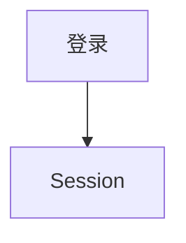

# 文档站维护

本文是 XJTUToolBox 文档站的维护速查。文档站基于 VitePress 构建，通用用法可以直接参考官方文档；本页重点说明本项目中新增页面、修改侧边栏、本地预览和检查构建的常见流程。

## TLDR

1. 在 `docs/tutorial/` 或 `docs/development/` 新增 `.md` 文件。
2. 在 `docs/.vitepress/config.mts` 的对应 `sidebar` 分组加入链接。
3. 本地运行 `npm run docs:dev` 预览。
4. 提交前运行 `npm run docs:build` 检查死链和构建错误。

## 目录结构

| 路径 | 用途 |
| --- | --- |
| `docs/index.md` | 文档站首页 |
| `docs/tutorial/` | 用户手册 |
| `docs/development/` | 开发文档 |
| `docs/tutorial/images/` | 用户手册截图 |
| `docs/.vitepress/config.mts` | VitePress 配置、导航、侧栏、搜索 |
| `docs/.vitepress/theme/` | 自定义主题入口与样式 |

用户手册面向普通用户，重点描述功能如何使用。开发文档面向贡献者，重点描述模块职责、数据流、扩展方式和维护约定。

## 本地运行

首次维护文档前，在仓库根目录安装前端依赖：

```bash
npm install
```

常用命令：

```bash
npm run docs:dev
npm run docs:build
npm run docs:preview
```

`docs:dev` 用于本地热更新预览。`docs:build` 用于提交前检查，VitePress 会报告构建错误和 dead links。`docs:preview` 用于预览构建产物。

VitePress 入门参考：[Getting Started](https://vitepress.dev/guide/getting-started)。

## 新增页面

VitePress 使用文件路由。`docs` 目录下的 Markdown 文件会映射为站点页面。

| 新增内容 | 文件位置 | 页面路径 |
| --- | --- | --- |
| 用户手册 | `docs/tutorial/new-page.md` | `/tutorial/new-page` |
| 开发文档 | `docs/development/new-page.md` | `/development/new-page` |

示例：

```bash
docs/development/attendance.md
```

对应页面路径为：

```text
/development/attendance
```

路由规则参考：[Routing](https://vitepress.dev/guide/routing)。

## 加入侧边栏

新增页面后，需要在 `docs/.vitepress/config.mts` 中加入侧边栏链接。

当前项目侧边栏按路径分组：

- `/tutorial/`：用户手册
- `/development/`：开发文档

开发文档内部再分为两个分组：

- `基础与机制`
- `业务模块`

新增业务模块文档时，将链接加入 `业务模块`：

```ts
{
  text: '业务模块',
  items: [
    { text: '考勤系统', link: '/development/attendance' },
    { text: '本科教务系统', link: '/development/jwxt' },
  ]
}
```

新增工程机制文档时，将链接加入 `基础与机制`：

```ts
{
  text: '基础与机制',
  items: [
    { text: '认证与登录系统', link: '/development/auth' },
    { text: 'Session 管理设计', link: '/development/session' },
  ]
}
```

侧边栏配置参考：[Default Theme Sidebar](https://vitepress.dev/reference/default-theme-sidebar)。

## 修改顶栏导航

顶栏配置位于 `themeConfig.nav`。当前项目保留三个顶栏入口：

- 主页
- 用户手册
- 开发指南

一般新增页面只需要修改侧边栏。新增一个大栏目时，再调整 `nav` 和 `sidebar` 的路径分组。

站点配置参考：[Site Config](https://vitepress.dev/reference/site-config)。

## 内部链接

同目录页面推荐使用相对链接：

```md
[认证与登录系统](./auth)
```

跨目录页面可以使用相对路径：

```md
[快速开始](../tutorial/quick-start)
```

也可以使用站点绝对路径：

```md
[用户手册](/tutorial/quick-start)
```

提交前运行 `npm run docs:build` 检查 dead links。目标页面还没有创建时，先用纯文本提及，等页面落地后再改成链接。

Markdown 扩展参考：[Markdown Extensions](https://vitepress.dev/guide/markdown)。

## 图片和静态资源

用户手册截图目前放在 `docs/tutorial/images/`。在用户手册中引用同目录图片：

```md

```

开发文档如果需要表达流程和架构，优先使用 Mermaid 图。用户指南中的界面说明适合使用真实截图。

## Mermaid 图

当前文档站已经启用 `vitepress-plugin-mermaid`，Markdown 中可以直接编写 Mermaid 图：

````md

````

工程机制文档中适合用 Mermaid 表达状态机、请求流程、模块依赖和数据流。

## Frontmatter

VitePress 支持在 Markdown 顶部使用 YAML frontmatter 覆盖页面级配置。多数页面保持默认配置即可。

示例：

```md
---
title: 自定义页面标题
---
```

Frontmatter 配置参考：[Frontmatter Config](https://vitepress.dev/reference/frontmatter-config)。

## 文档风格约定

- 用户手册面向普通用户，优先描述操作步骤、功能效果和常见问题。
- 开发文档面向贡献者，优先描述模块职责、数据流、扩展方式和维护约定。
- 模块文档优先解释设计与调用流程，逐类 API Reference 可以后续补充。
- 新增用户可见功能时，同步检查用户手册是否需要更新。
- 新增工程机制或业务模块时，同步检查开发文档是否需要更新。
- 页面使用一级标题作为主标题。
- 代码路径、命令、类名和配置项使用反引号。
- 页面尚未落地时，先避免创建内部链接，减少 dead links。

## 常见维护任务

新增用户手册：

1. 在 `docs/tutorial/` 新增 Markdown 文件。
2. 在 `/tutorial/` 侧边栏加入链接。
3. 如有截图，放入 `docs/tutorial/images/`。
4. 运行 `npm run docs:dev` 预览。

新增开发文档：

1. 在 `docs/development/` 新增 Markdown 文件。
2. 根据类型加入 `基础与机制` 或 `业务模块` 分组。
3. 如需流程图，直接使用 Mermaid。
4. 运行 `npm run docs:build` 检查。

调整侧边栏顺序：

1. 修改 `docs/.vitepress/config.mts` 中对应 `items` 的顺序。
2. 本地预览导航和上一页/下一页顺序。

修复 dead link：

1. 查看 `npm run docs:build` 输出中的文件和链接。
2. 检查目标 Markdown 文件是否存在。
3. 检查相对路径是否正确。
4. 页面尚未创建时，改为纯文本或先创建占位页面。

## 构建失败排查

`npm run docs:build` 常见失败原因是 dead link：

```text
Found dead link ./attendance in file development/introduction.md
```

处理方式：

1. 打开报错文件。
2. 找到对应链接。
3. 确认目标文件路径。
4. 修正链接或创建目标页面。

VitePress 提供 `ignoreDeadLinks` 配置。项目维护时优先修复死链，让构建结果持续反映文档健康状态。

相关配置参考：[Site Config](https://vitepress.dev/reference/site-config)。

## 继续阅读

- [VitePress Getting Started](https://vitepress.dev/guide/getting-started)
- [Routing](https://vitepress.dev/guide/routing)
- [Markdown Extensions](https://vitepress.dev/guide/markdown)
- [Default Theme Sidebar](https://vitepress.dev/reference/default-theme-sidebar)
- [Site Config](https://vitepress.dev/reference/site-config)
- [Frontmatter Config](https://vitepress.dev/reference/frontmatter-config)
