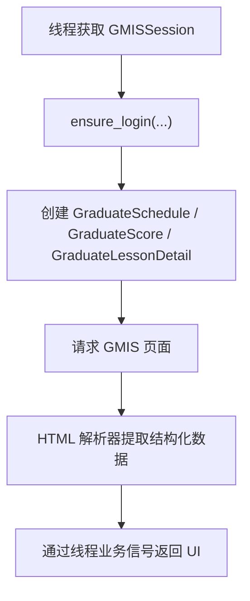

# 研究生管理信息系统模块

`gmis` 模块封装研究生管理信息系统 `gmis.xjtu.edu.cn`。它主要服务研究生课表、研究生成绩和研究生课程详情查询。

GMIS 的多个功能通过 HTML 页面提供数据，因此本模块的重点是把页面内容解析为 GUI 和线程层可以直接消费的结构化结果。

## 模块职责

`gmis` 模块当前支持：

- 研究生课表查询。
- 当前学期识别。
- 学期代码转换。
- 学期开始日期查询。
- 研究生成绩查询。
- 研究生课程详情查询。
- 为研究生评教流程提供课程详情和成绩辅助信息。

研究生评教提交逻辑位于 `gste` 模块。`GraduateJudgeThread` 会同时使用 `gste` 和 `gmis`：前者处理评教系统，后者补充课程详情与历史成绩信息。

## 代码位置

| 文件 | 职责 |
| --- | --- |
| `gmis/schedule.py` | 研究生课表查询、学期转换、开学日期查询 |
| `gmis/schedule_parser.py` | 研究生课表 HTML 解析 |
| `gmis/score.py` | 研究生成绩 HTML 解析与 GPA 计算 |
| `gmis/lesson_detail.py` | 研究生课程详情 HTML 解析 |
| `app/sessions/gmis_session.py` | GUI 层 GMIS Session |
| `app/threads/GraduateScheduleThread.py` | 研究生课表查询线程 |
| `app/threads/GraduateScoreThread.py` | 研究生成绩查询线程 |
| `app/threads/GraduateJudgeThread.py` | 研究生评教线程中辅助使用 GMIS |

## 共享登录与 GMISSession

GUI 程序通过 `GMISSession` 复用研究生管理信息系统登录态。

| 字段 | 值 | 含义 |
| --- | --- | --- |
| `site_key` | `gmis` | SessionManager 中的注册名称 |
| `site_name` | `研究生管理信息系统` | 展示给用户的站点名称 |
| `supports_webvpn` | `True` | 支持 WebVPN 访问 |
| `use_webvpn_when_off_campus` | `False` | 自动校外探测时默认仍尝试直连 |

`GMISSession._login()` 根据访问方式选择登录器：

- `AccessMode.NORMAL`：`NewLogin` / `NewQRCodeLogin`
- `AccessMode.WEBVPN`：`NewWebVPNLogin` / `NewWebVPNQRCodeLogin`

登录入口是 `GMIS_LOGIN_URL`。统一认证身份固定为 `NewLogin.POSTGRADUATE`。

`validate_login()` 访问研究生课表页面 `/pyxx/pygl/xskbcx`，并通过页面内容中是否出现 `drpxq`、`xskbcx` 或“课表”判断登录态。

## 功能域总览

| 功能 | API 类/函数 | 线程/UI |
| --- | --- | --- |
| 研究生课表 | `GraduateSchedule`、`schedule_parser` | `GraduateScheduleThread` / `ScheduleInterface` |
| 研究生成绩 | `GraduateScore`、`parse_score_html()` | `GraduateScoreThread` / `ScoreInterface` |
| 课程详情 | `GraduateLessonDetail`、`parse_from_html()` | `GraduateJudgeThread` |
| 学期开始日期 | `GraduateSchedule.getStartOfTermMap()` | `GraduateScheduleThread` |

## 课表查询与学期转换

课表相关 API 位于 `gmis/schedule.py` 的 `GraduateSchedule` 类。

| 方法 | 用途 |
| --- | --- |
| `timestampToTerm(timestamp)` | 把 `2024-2025-1` 转成 `2024秋` |
| `termToTimestamp(term)` | 把 `2025春` 转成 `2024-2025-2` |
| `getCurrentTerm(use_cache=True)` | 获取当前学期代码 |
| `getSchedule(timestamp, use_cache=True)` | 获取指定学期课表 |
| `getStartOfTermMap()` | 通过电子校历接口获取学期开始日期映射 |

项目内部统一使用 `YYYY-YYYY-1/2` 形式的学年学期代码。GMIS 页面使用 `YYYY春` / `YYYY秋` 描述学期，因此模块提供双向转换函数。

转换规则：

| 项目内部代码 | GMIS 描述 |
| --- | --- |
| `2024-2025-1` | `2024秋` |
| `2024-2025-2` | `2025春` |

GMIS 页面只支持春/秋学期描述。传入尾号为 `1` 或 `2` 以外的学期代码时，转换函数会抛出 `ValueError`。

`GraduateSchedule` 会缓存课表页面：

- `_schedule_page_cache` 保存页面 HTML。
- `_last_modified` 保存缓存时间。
- 缓存有效期为 10 分钟。
- `_term_value_map` 保存学期描述到页面 value 的映射。

当前学期识别和默认课表查询共用同一个页面，因此缓存可以减少重复请求。

## 课表 HTML 解析

课表解析逻辑位于 `gmis/schedule_parser.py`。

| 函数 | 用途 |
| --- | --- |
| `parse_html_to_json(html_content)` | 从课表 HTML 解析课程列表 |
| `parse_semester_options(html_content)` | 解析学期下拉框选项 |
| `parse_current_semester(html_content)` | 解析当前选中学期 |
| `_extract_js_course_data(html_content)` | 从页面 JavaScript 中提取课程片段 |
| `_parse_course_to_dict(course_data)` | 将课程片段解析为字典 |
| `_parse_periods(periods_str)` | 解析节次范围 |

GMIS 课表页面会在 JavaScript 中给 `td_数字_数字.innerHTML` 赋值。解析器从这些脚本片段中提取课程文本，再解析课程名、教师、教室、节次和周次。

课程返回结构示例：

```python
{
    "name": "高等数学B(1)",
    "teacher": "张三",
    "classroom": "5-1w32",
    "periods": "3-4",
    "weeks": "1-16周",
    "day_of_week": 1,
    "period_start": 3,
    "period_end": 4,
}
```

解析失败的课程片段会被跳过。维护课表解析逻辑时，应重点检查页面脚本中的 `td_数字_数字` 格式和课程文本字段。

## 成绩查询与 GPA

成绩相关 API 位于 `gmis/score.py`。

| 方法/函数 | 用途 |
| --- | --- |
| `GraduateScore.grade()` | 返回已有成绩的课程 |
| `GraduateScore.all_course_info()` | 返回成绩页面全部课程信息 |
| `parse_score_html(html)` | 解析全部课程表格 |
| `extract_scores_with_grades_only(html)` | 只提取已有成绩课程 |
| `score_to_gpa(score)` | 按 `GPA_RULES` 映射 GPA |

成绩页面包含三类表格：

- 学位课程
- 选修课程
- 必修环节

`grade()` 访问 `/pyxx/pygl/xscjcx/index`，只返回已有成绩的课程。返回结构示例：

```python
{
    "courseName": "自然辩证法概论",
    "coursePoint": 1,
    "score": 100,
    "type": "学位课程",
    "examDate": "2025-01-19",
    "gpa": 4.3,
}
```

研究生成绩页面无法得知每门课程所属学期，也没有本科成绩那样的分项详情。因此 `GraduateScore.grade()` 返回的是全部已有成绩课程，`ScoreInterface` 会按研究生成绩路径展示这些数据。

`all_course_info()` 会返回成绩页面上所有课程，包括尚未有成绩的课程。它主要用于需要查看培养方案完成状态或课程列表的场景。

GPA 由本地 `GPA_RULES` 映射得到，来源是模块内规则表。

## 课程详情查询

课程详情相关 API 位于 `gmis/lesson_detail.py`。

| 方法/函数 | 用途 |
| --- | --- |
| `GraduateLessonDetail.lesson_detail(lesson_id, year)` | 获取课程详情 |
| `parse_from_html(html_text)` | 解析课程详情 HTML |

`lesson_id` 当前主要从研究生评教系统 `gste` 的问卷中获得。`year` 缺省时，代码会根据当前日期推算当前学年：9 月及以后使用当前年份，1 到 8 月使用上一年份。

课程详情返回中文字段名，包括：

- 课程编号
- 课程名称
- 学校统一课程编号
- 开课季节
- 课程级别
- 课程类别
- 学分和学时
- 课程负责人
- 授课方式和授课语言
- 课程简介
- 教学团队
- 课程教材
- 主要参考书
- 教学日历

`GraduateJudgeThread` 会使用 `GraduateLessonDetail` 获取课程详情，用于研究生评教流程中的辅助判断和展示。

## 典型调用流程

GMIS 功能通常由线程获取 `GMISSession`，再创建对应 API 包装器。



简化代码示例：

```python
from gmis.schedule import GraduateSchedule

session = accounts.current.session_manager.get_session("gmis")
session.ensure_login(
    accounts.current.username,
    accounts.current.password,
    account=accounts.current,
)

util = GraduateSchedule(session)
lessons = util.getSchedule()
```

API 包装器是轻量对象。当前 session 变化或访问方式变化后，应重新创建对应包装器。

## 与线程层的关系

| 线程 | 使用内容 | 返回 |
| --- | --- | --- |
| `GraduateScheduleThread` | `GraduateSchedule` | `schedule` 信号，包含课程列表、学期编号、开学日期 |
| `GraduateScoreThread` | `GraduateScore` | `scores(result, True)` |
| `GraduateJudgeThread` | `GraduateLessonDetail`、`GraduateScore` | 研究生评教辅助数据 |

`GraduateScheduleThread` 会检查当前账号是否为研究生账号。账号类型不匹配时，它会通过 `error` 和 `canceled` 信号结束。

`GraduateScoreThread` 在返回成绩时固定将第二个参数设为 `True`，让 `ScoreInterface` 使用研究生成绩展示路径。

研究生评教属于 `gste` 主流程。`GraduateJudgeThread` 会通过 `GMISSession` 查询课程详情和已有成绩，用于补充评教所需信息。

## 与 UI 层的关系

| UI | 使用功能 |
| --- | --- |
| `ScheduleInterface` | 研究生课表 |
| `ScoreInterface` | 研究生成绩 |
| `AutoJudgeInterface` / 研究生评教子界面 | 课程详情、成绩辅助信息 |

`ScheduleInterface` 会把 GMIS 课表列表写入本地课表数据库。`ScoreInterface` 会把 `GraduateScoreThread` 返回结果作为研究生成绩展示。

## 数据格式与转换边界

`gmis` 模块的主要边界是 HTML 解析：

- 课表解析器返回简化课程字典。
- 成绩解析器返回 GUI 成绩界面可消费的字段。
- 课程详情保留中文字段名，因为页面本身是中文表格。
- 线程和 UI 层消费结构化结果，页面解析逻辑集中在 `gmis/` 内。

这种边界可以减少 UI 层对 GMIS 页面结构的依赖。页面结构变化时，优先维护 `schedule_parser.py`、`score.py` 或 `lesson_detail.py`。

## 维护注意事项

- GMIS 多个接口返回 HTML 页面，解析器依赖页面结构。
- 修改课表解析时重点检查 JavaScript 中 `td_数字_数字` 的格式。
- 修改成绩解析时重点检查三个 `sample-table-1` 表格的顺序和列结构。
- 研究生成绩没有学期字段，UI 逻辑应按“全部成绩”处理。
- 学期转换只支持春/秋学期，对尾号为 `1` 或 `2` 以外的学期代码会抛出 `ValueError`。
- `getStartOfTermMap()` 使用新师生服务大厅电子校历接口，当前通过同一个 session 发请求。
- 新增 GMIS API 时，优先把 HTML 解析逻辑放在 `gmis/` 内，让线程和 UI 层只处理结构化结果。

## 已知限制

- 课表解析依赖 GMIS 页面内嵌 JavaScript。
- 成绩页面无法提供课程所属学期和成绩分项详情。
- GPA 由本地 `GPA_RULES` 映射。
- 课程详情接口当前主要服务研究生评教流程，`lesson_id` 来源有限。
- WebVPN 可用性取决于 GMIS 页面在 WebVPN 下的表现。

## 继续阅读

- [认证与登录系统](./auth)：统一认证、二维码登录与 WebVPN 登录器。
- [Session 管理设计](./session)：`GMISSession` 如何复用登录态和选择访问方式。
- [子线程与进度反馈设计](./thread)：研究生课表和成绩线程如何向 GUI 汇报进度。
- [本科教务系统模块](./jwxt)：本科生课表、成绩、评教和空闲教室 API。
- [课表与考勤用户手册](../tutorial/schedule)：用户视角的研究生课表功能。
- [成绩查询与计算用户手册](../tutorial/score)：用户视角的研究生成绩功能。
