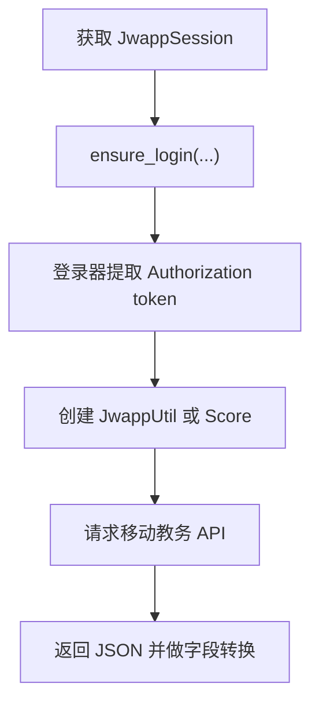

# 移动教务模块

::: warning 当前状态
`jwapp` 模块当前没有接入实际业务界面，只保留移动教务登录与 API 访问能力。当前 GUI 中的本科成绩查询主流程使用 `jwxt/score.py`，并把返回字段转换为移动教务兼容格式。
:::

`jwapp` 模块封装移动教务系统 `jwapp.xjtu.edu.cn`。它的主要价值是保留移动教务的 token 登录方式、学校时间接口和成绩接口，方便后续恢复或新增移动教务相关功能。

## 模块职责

`jwapp` 模块当前支持：

- 移动教务统一认证登录。
- 从登录回调 URL 中提取移动教务 `Authorization` token。
- 普通登录、二维码登录、WebVPN 登录和 WebVPN 二维码登录。
- 查询移动教务学校时间与当前学期。
- 根据移动教务学校时间推算开学日期。
- 访问移动教务成绩、成绩详情和成绩分析接口。

本科教务主业务位于 `jwxt` 模块。`jwapp` 中的成绩接口保留了直接访问移动教务 API 的能力，当前应用内成绩查询使用 `jwxt.Score.grade(..., jwapp_format=True)` 生成移动教务风格字段。

## 代码位置

| 文件 | 职责 |
| --- | --- |
| `jwapp/util.py` | 移动教务登录器、通用接口、当前学期和开学日期 |
| `jwapp/score.py` | 移动教务成绩、成绩详情、成绩分析接口 |
| `app/sessions/jwapp_session.py` | GUI 层移动教务 Session |
| `auth/constant.py` | `JWAPP_URL` 登录入口 |
| `app/main_window.py` | 注册 `JwappSession` |
| `jwxt/score.py` | 当前成绩主流程中的移动教务兼容格式转换 |

## 当前使用状态

`JwappSession` 已在 `registerSession()` 中注册：

```python
SessionManager.global_register(JwappSession, "jwapp")
```

这表示账号的 `SessionManager` 可以按 `site_key = "jwapp"` 创建和复用移动教务 session。

当前项目中没有独立的移动教务成绩线程或移动教务界面。维护本科成绩查询时，优先阅读 [本科教务系统模块](./jwxt)；维护移动教务登录、token 或移动教务原始 API 时，再阅读本页。

## 登录与 Authorization Token

移动教务登录入口定义在 `auth/constant.py`：

```python
JWAPP_URL = "https://org.xjtu.edu.cn/openplatform/oauth/authorize?appId=1370&redirectUri=http://jwapp.xjtu.edu.cn/app/index&responseType=code&scope=user_info&state=1234"
```

登录器位于 `jwapp/util.py`：

| 登录器 | 用途 |
| --- | --- |
| `JwappNewLogin` | 直连密码登录 |
| `JwappNewQRCodeLogin` | 直连二维码登录 |
| `JwappNewWebVPNLogin` | WebVPN 密码登录 |
| `JwappNewWebVPNQRCodeLogin` | WebVPN 二维码登录 |

移动教务与考勤系统类似，统一认证完成后还需要从回调 URL 中提取业务 token。`postLogin()` 会读取 `login_response.url` 中的 `token=` 参数，并写入当前 session 的请求头：

```python
self.session.headers.update({"Authorization": token})
```

后续移动教务 API 请求依赖这个 `Authorization` 请求头。

## JwappSession

GUI 程序通过 `JwappSession` 复用移动教务登录态。它的关键配置如下：

| 字段 | 值 | 含义 |
| --- | --- | --- |
| `site_key` | `jwapp` | SessionManager 中的注册名称 |
| `site_name` | `移动教务系统` | 展示给用户的站点名称 |
| `supports_webvpn` | `True` | 支持 WebVPN 访问 |
| `use_webvpn_when_off_campus` | `False` | 自动校外探测时默认仍尝试直连 |

`JwappSession._login()` 根据访问方式选择登录器：

- `AccessMode.NORMAL`：`JwappNewLogin` / `JwappNewQRCodeLogin`
- `AccessMode.WEBVPN`：`JwappNewWebVPNLogin` / `JwappNewWebVPNQRCodeLogin`

登录账号类型固定为 `NewLogin.UNDERGRADUATE`。登录成功后，session 会调用 `reset_timeout()`，并将 `has_login` 设为 `True`。

`validate_login()` 先检查请求头中是否存在 `Authorization`，再访问移动教务学校时间接口：

```text
https://jwapp.xjtu.edu.cn/api/biz/v410/common/school/time
```

如果响应 JSON 中 `code == 200`，则认为当前移动教务登录态可用。

## 通用接口 JwappUtil

`JwappUtil` 位于 `jwapp/util.py`，封装移动教务通用接口。

| 方法 | 用途 |
| --- | --- |
| `getTimeTableBasis()` | 获取当前学校时间、学期、周次和节次数 |
| `getBeginOfTerm()` | 根据当前周数和星期推算开学日期 |
| `getCurrentTerm()` | 返回当前学期代码 |
| `_get()` | 发起 GET 请求并调用 `raise_for_status()` |
| `_post()` | 发起 POST 请求并调用 `raise_for_status()` |

`getTimeTableBasis()` 请求学校时间接口，返回示例字段包括：

- `xnxqdm`：当前学期代码，例如 `2023-2024-2`。
- `maxWeekNum`：最大周数。
- `maxSection`：最大节次数。
- `weekCalendar`：当前周日期列表。
- `todayWeekDay`：今天是周几。
- `todayWeekNum`：今天是第几周。
- `xnxqmc`：当前学期中文名称。

`getBeginOfTerm()` 使用 `todayWeekNum` 和 `todayWeekDay` 从当天日期反推第一周周一日期。这个结果依赖移动教务返回的当前周信息。

`JwappUtil` 的对象适合在需要调用接口时临时创建。代码注释中提到，同一个 session 的连接可能存在时间限制，因此当前 session 变化后应重新创建工具对象。

## 成绩接口 Score

移动教务成绩 API 位于 `jwapp/score.py` 的 `Score` 类。

| 方法 | 用途 |
| --- | --- |
| `grade(term=None)` | 查询某学期或全部学期成绩 |
| `detail(id_)` | 查询单门课程成绩详情 |
| `rank(id_)` | 查询课程成绩分析 |

`grade()` 访问：

```text
http://jwapp.xjtu.edu.cn/api/biz/v410/score/termScore
```

传入 `term=None` 时会使用 `*` 查询全部学期。返回结果是按学期分组的成绩列表，每门课程包含课程名、成绩、学分、考核方式、初修/重修状态等字段。

数据清洗规则：

- `score` 会尽量转换为 `float`。
- 字母等级成绩会保留字符串。
- `coursePoint` 会转换为 `float`。

`detail(id_)` 访问：

```text
http://jwapp.xjtu.edu.cn/api/biz/v410/score/scoreDetail
```

`id_` 来自 `grade()` 返回课程中的 `id` 字段。详情结果包含单门课程的总成绩、GPA、通过状态和分项成绩。代码会把 `gpa`、`coursePoint`、`score`、`itemPercent` 和 `itemScore` 转成数值，其中 `itemPercent` 会从百分数字符串转成 `0 到 1` 之间的小数。

`rank(id_)` 访问：

```text
http://jwapp.xjtu.edu.cn/api/biz/v410/score/scoreAnalyze
```

该接口用于查询课程排名百分比、最高分、平均分、最低分和分数段人数。代码注释记录：从 2024 年 12 月开始，此接口返回数据多为 `null`。使用它之前需要重新确认接口状态。

## 与 jwxt 成绩格式的关系

当前 GUI 成绩查询主流程使用 `jwxt.Score.grade(..., jwapp_format=True)`。这个参数会让本科教务系统的原始成绩 rows 转成移动教务风格字段，例如：

- `courseName`
- `coursePoint`
- `examType`
- `majorFlag`
- `examProp`
- `replaceFlag`
- `score`
- `gpa`
- `passFlag`
- `specificReason`
- `itemList`

这种格式借用了移动教务字段命名，字段含义更清晰，也方便成绩界面统一消费。

需要注意的是，`jwxt` 成绩接口无法提供课程置换字段，因此转换后的 `replaceFlag` 固定为 `False`。部分成绩分项比例也可能缺失，`jwxt/score.py` 会在可推算时补全缺失比例。

## 典型调用流程

直接使用移动教务 API 时，调用方通常先获取 `JwappSession`，确保登录后再创建工具类。



简化代码示例：

```python
from jwapp.score import Score

session = accounts.current.session_manager.get_session("jwapp")
session.ensure_login(
    accounts.current.username,
    accounts.current.password,
    account=accounts.current,
)

score_util = Score(session)
terms = score_util.grade()
```

## 维护注意事项

- 移动教务 API 依赖 `Authorization` 请求头，登录后的 token 提取是核心步骤。
- 新增移动教务接口时，建议复用 `JwappUtil._get()` 和 `_post()` 的请求风格。
- 当前本科成绩业务主入口位于 `jwxt/score.py`，修改成绩展示字段时需要同时检查移动教务兼容格式。
- `rank()` 接口当前可用性有限，恢复使用前需要确认移动教务返回数据。
- WebVPN 路径下的可用性取决于移动教务页面和 API 在 WebVPN 下的实际表现。

## 继续阅读

- [认证与登录系统](./auth)：统一认证、二维码登录、WebVPN 登录与 `postLogin()` 扩展点。
- [Session 管理设计](./session)：`JwappSession` 如何接入 `SessionManager`。
- [本科教务系统模块](./jwxt)：当前本科课表、成绩、评教和空闲教室主业务实现。
