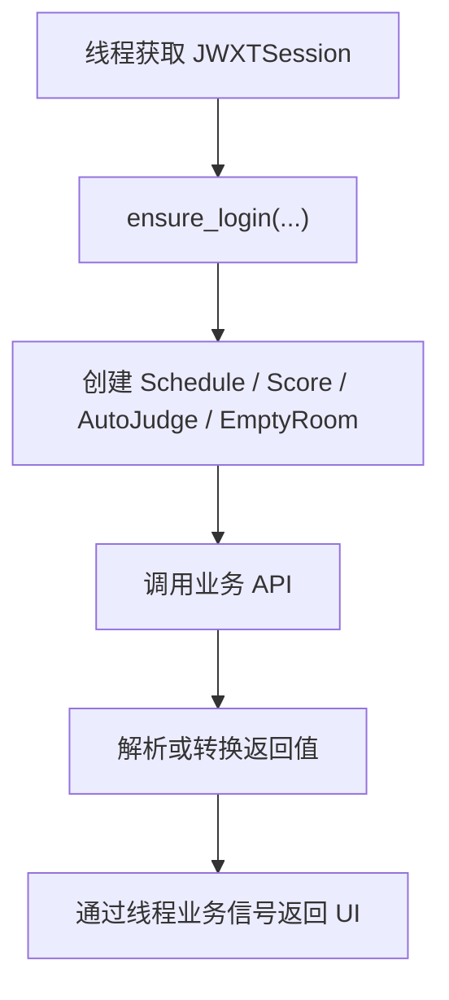

# 本科教务系统模块

`jwxt` 模块封装本科教务系统 `jwxt.xjtu.edu.cn` 相关 API。它覆盖课表、考试安排、成绩查询、一键评教和空闲教室查询，是本科生相关功能的主要底层模块。

研究生课表与成绩主要位于 `gmis` 模块，研究生评教位于 `gste` 模块。

## 模块职责

`jwxt` 模块当前支持：

- 本科课表查询。
- 考试安排查询。
- 学期开始日期查询。
- 本科成绩查询。
- 成绩单报表查询。
- 本科评教问卷查询、填写、提交。
- 空闲教室查询。
- 教务系统用户角色查询与切换。

## 代码位置

| 文件 | 职责 |
| --- | --- |
| `jwxt/schedule.py` | 本科课表、考试安排、学期开始日期 |
| `jwxt/score.py` | 本科成绩查询与成绩单报表解析 |
| `jwxt/judge.py` | 本科评教问卷查询、填写、提交 |
| `jwxt/questionnaire_template.py` | 评教模板读取与题目匹配 |
| `jwxt/empty_room.py` | 空闲教室查询 |
| `jwxt/util.py` | 用户角色查询与切换 |
| `app/sessions/jwxt_session.py` | GUI 层本科教务 Session |
| `app/threads/ScheduleThread.py` | 本科课表查询线程 |
| `app/threads/ExamScheduleThread.py` | 考试安排查询线程 |
| `app/threads/ScoreThread.py` | 本科成绩查询线程 |
| `app/threads/JudgeThread.py` | 本科评教线程 |
| `app/threads/EmptyRoomThread.py` | 教务系统空闲教室查询线程 |

## 共享登录与 JWXTSession

GUI 程序通过 `JWXTSession` 复用本科教务系统登录态。它的关键配置如下：

| 字段 | 值 | 含义 |
| --- | --- | --- |
| `site_key` | `jwxt` | SessionManager 中的注册名称 |
| `site_name` | `本科教务系统` | 展示给用户的站点名称 |
| `supports_webvpn` | `True` | 支持 WebVPN 访问 |
| `use_webvpn_when_off_campus` | `False` | 自动校外探测时默认仍尝试直连 |

`JWXTSession._login()` 根据访问方式选择登录器：

- `AccessMode.NORMAL`：`NewLogin` / `NewQRCodeLogin`
- `AccessMode.WEBVPN`：`NewWebVPNLogin` / `NewWebVPNQRCodeLogin`

登录入口是 `JWXT_LOGIN_URL`。本科教务系统主要依赖统一认证后的 cookie，登录后没有像考勤系统那样额外提取 `Synjones-Auth`。

`validate_login()` 会访问 `currentUser.do` 接口，并检查返回结果中 `code == "0"` 且 `datas` 为字典。这个接口也是 `JWXTUtil.getUserRoles()` 使用的用户信息接口。

## 用户角色与 JWXTUtil

教务系统中同一用户可能有多个应用角色，例如“学生”和“移动应用学生”。部分接口在不同角色下可用性不同，因此 `jwxt/util.py` 提供角色查询与切换工具。

| 方法 | 用途 |
| --- | --- |
| `getUserRoles()` | 获取当前用户所有角色 |
| `getCurrentUserRole()` | 获取当前正在使用的角色 |
| `setUserRole(roleId)` | 切换到指定角色 |
| `setRoleToStudent()` | 切换到“学生”角色 |

空闲教室查询依赖“学生”角色。`EmptyRoom` 初始化时会创建 `JWXTUtil` 并调用 `setRoleToStudent()`。

## 功能域总览

`jwxt` 是一组共享 `JWXTSession` 的业务 API。不同功能域对应不同 API 类、线程和界面。

| 功能 | API 类 | 线程 | UI |
| --- | --- | --- | --- |
| 课表 | `jwxt.schedule.Schedule` | `ScheduleThread` | `ScheduleInterface` |
| 考试安排 | `jwxt.schedule.Schedule` | `ExamScheduleThread` / `ScheduleThread` | `ScheduleInterface` |
| 成绩 | `jwxt.score.Score` | `ScoreThread` | `ScoreInterface` |
| 评教 | `jwxt.judge.AutoJudge` | `JudgeThread` | `AutoJudgeInterface` |
| 空闲教室 | `jwxt.empty_room.EmptyRoom` | `EmptyRoomThread` | `EmptyRoomInterface` |

## 课表与考试安排

课表相关 API 位于 `jwxt/schedule.py` 的 `Schedule` 类。

| 方法 | 用途 |
| --- | --- |
| `getCurrentTerm()` | 获取当前学年学期代码 |
| `termString` | 当前学期代码缓存属性 |
| `getSchedule(timestamp)` | 获取指定学期课程表 |
| `getExamSchedule(timestamp)` | 获取指定学期考试安排 |
| `getStartOfTerm(timestamp)` | 获取学期开始日期 |

`timestamp` 是形如 `2024-2025-1` 的学年学期代码。调用方传入 `None` 时，`Schedule` 会查询并缓存当前学期代码。

这些方法返回教务系统原始 rows。线程和 UI 层会进一步把 rows 转换为本地课表数据库、课表展示对象或考试安排对象。

`ScheduleThread` 会在一次线程任务中查询：

1. 课表 rows。
2. 考试安排 rows。
3. 学期开始日期。

`ExamScheduleThread` 则用于单独刷新考试安排。

## 成绩查询

成绩相关 API 位于 `jwxt/score.py` 的 `Score` 类。

| 方法 | 用途 |
| --- | --- |
| `grade(term, jwapp_format=True)` | 查询成绩，可返回移动教务兼容格式 |
| `reported_grade(student_id, term)` | 通过成绩单报表查询更多成绩 |
| `extract_fr_session_id_from_html()` | 解析 FR 报表 session id |
| `extract_fr_report_total_page_from_html()` | 解析 FR 报表总页数 |
| `extract_course_scores_from_fr_form_html()` | 从报表 HTML 提取课程成绩 |

成绩查询有两类来源。

`grade()` 直接访问教务系统成绩查询接口。默认 `jwapp_format=True`，会将教务系统字段转换为移动教务风格字段，例如：

- `courseName`
- `coursePoint`
- `examType`
- `majorFlag`
- `examProp`
- `score`
- `gpa`
- `passFlag`
- `itemList`

这个来源无法提供课程置换字段，转换后 `replaceFlag` 固定为 `False`。部分成绩分项百分比在教务系统接口中缺失，当只有一个分项百分比缺失时，代码会根据总和为 1 的约束补全。

`reported_grade()` 通过成绩单 FR 报表获取成绩。它用于“通过成绩单绕过评教限制”的场景。该流程需要先解析报表 HTML 中的 session id 和总页数，再逐页提取课程成绩。

`ScoreThread` 会根据 `cfg.useScoreReport` 决定是否合并成绩单结果。合并时会按课程名去重，避免普通成绩接口和成绩单报表返回重复课程。

## 评教系统

评教相关 API 位于 `jwxt/judge.py`，本地模板逻辑位于 `jwxt/questionnaire_template.py`。

核心类型：

| 类型 | 含义 |
| --- | --- |
| `Questionnaire` | 一门课程的一张评教问卷元信息 |
| `QuestionnaireData` | 问卷中的一道题 |
| `QuestionnaireOptionData` | 某道题的可选答案 |
| `AutoJudge` | 评教接口封装 |
| `QuestionnaireTemplate` | 本地评教模板 |
| `QuestionnaireTemplateData` | 模板中的题目匹配规则 |

`AutoJudge` 的问卷列表方法：

| 方法 | 用途 |
| --- | --- |
| `midTermQuestionnaires(timestamp, finished)` | 获取过程性评教问卷 |
| `endTermQuestionnaires(timestamp, finished)` | 获取期末评教问卷 |
| `finishedQuestionnaires(timestamp)` | 获取已完成问卷 |
| `unfinishedQuestionnaires(timestamp)` | 获取未完成问卷 |
| `allQuestionnaires(timestamp)` | 获取全部问卷 |

问卷内容方法：

| 方法 | 用途 |
| --- | --- |
| `questionnaireData(questionnaire, username)` | 获取问卷题目 |
| `questionnaireOptions(questionnaire, username, finished)` | 获取题目选项 |

提交与编辑方法：

| 方法 | 用途 |
| --- | --- |
| `submitQuestionnaire(questionnaire, data)` | 提交已填写问卷 |
| `editQuestionnaire(questionnaire, username)` | 将已完成问卷改回可编辑状态 |

题型由 `TXDM` 字段表示：

| `TXDM` | 含义 | 填写方式 |
| --- | --- | --- |
| `01` | 客观题 | `QuestionnaireData.setOption()` |
| `02` | 主观题 | `QuestionnaireData.setSubjectiveOption()` |
| `03` | 分值题 | `QuestionnaireData.setScore()` |

`QuestionnaireTemplate` 用于批量填写问卷。它会优先按题目代码 `ZBDM` 匹配模板项，再按题目名称包含关系匹配。没有匹配到模板项时，可以根据 `always_complete` 和默认分数/主观题文本决定是否自动补全。

模板文件位于 `jwxt/templates/`，命名规则为：

```text
{type}-{score}.json
```

例如 `theory-100.json` 表示理论课 100 分模板。

`JudgeThread` 使用 `AutoJudge` 和 `QuestionnaireTemplate` 执行单个评教、编辑已完成问卷、一键评教多个课程等操作。

## 空闲教室查询

空闲教室相关 API 位于 `jwxt/empty_room.py` 的 `EmptyRoom` 类。

| 方法 | 用途 |
| --- | --- |
| `getCampusCode()` | 获取校区名称到代码映射 |
| `getBuildingCode()` | 获取教学楼名称到代码映射 |
| `getEmptyRoom(campusCode, buildingCode, date, startTime, endTime)` | 查询指定时间段空闲教室 |
| `getEmptyRoomInDay(campusCode, buildingCode, date)` | 查询一整天每节课的空闲教室 |

`EmptyRoom` 初始化时会切换到“学生”角色，因为空闲教室接口在“移动应用学生”等角色下不可用。

`CAMPUS_BUILDING_DICT` 是本地维护的校区与教学楼列表，用于 UI 快速选择。学校调整校区或楼名时，需要同步更新这份列表。

`getEmptyRoom()` 会对接口结果做轻量过滤：

- 跳过缺少教室类型的记录。
- 跳过名称包含“测试专用”的测试教室。

返回值是简化后的字典列表，包含教室名称、教学楼名称、教室类型、座位数、考试座位数和校区名称。

## 典型调用流程

各功能域的调用流程基本一致：先获取 `JWXTSession`，再创建对应 API 包装器。



简化代码示例：

```python
from jwxt.schedule import Schedule

session = accounts.current.session_manager.get_session("jwxt")
session.ensure_login(
    accounts.current.username,
    accounts.current.password,
    account=accounts.current,
)

schedule = Schedule(session)
rows = schedule.getSchedule()
```

API 包装器是轻量对象。当前 session 变化或访问方式变化后，应重新创建对应包装器。

## 与线程层的关系

`jwxt` 相关 UI 功能通常通过 `ProcessThread` 子类调用 API。

| 线程 | 使用的 API 类 | 主要返回信号 |
| --- | --- | --- |
| `ScheduleThread` | `Schedule` | `schedule`、`exam` |
| `ExamScheduleThread` | `Schedule` | `exam` |
| `ScoreThread` | `Score` | `scores` |
| `JudgeThread` | `AutoJudge`、`QuestionnaireTemplate` | 根据操作发出完成或错误 |
| `EmptyRoomThread` | `EmptyRoom` | 空闲教室结果 |

这些线程通过 `JWXTSession.ensure_login()` 复用本科教务系统登录态，并通过 `ProcessThread` 信号反馈进度、错误和结果。

## 与 UI 层的关系

当前 UI 入口如下：

| UI | 使用功能 |
| --- | --- |
| `ScheduleInterface` | 课表、考试安排 |
| `ScoreInterface` | 成绩查询 |
| `AutoJudgeInterface` | 一键评教 |
| `EmptyRoomInterface` | 空闲教室查询 |

`ScheduleInterface` 还会将教务系统课表数据写入本地课表数据库，并和考勤模块返回的课程考勤状态结合展示。

`ScoreInterface` 使用 `ScoreThread` 获取成绩，并在界面中完成均分、绩点、自选课程等计算展示。

`AutoJudgeInterface` 使用 `JudgeThread` 查询未完成问卷、套用模板、提交问卷或编辑已完成问卷。

`EmptyRoomInterface` 使用 `EmptyRoomThread` 查询空闲教室；项目中还存在 CDN 查询线程 `CFEmptyRoomThread`，用于读取预生成的空闲教室数据。

## 数据格式与转换边界

`jwxt` 模块中，不同功能域的数据转换边界不同：

- 课表和考试安排保留较多教务系统原始 rows，上层线程和 UI 负责写入本地课表数据库或转换为展示结构。
- 成绩查询可以通过 `Score.grade(..., jwapp_format=True)` 转换为字段较清晰的移动教务兼容格式。
- 评教问卷使用 `QuestionnaireData` 和 `QuestionnaireOptionData` 结构化题目和选项。
- 空闲教室查询返回简化字典，隐藏教务系统原始字段。

维护时应优先保持每个功能域当前的数据边界，避免在 UI 层重复解析同一份原始数据。

## 维护注意事项

- `jwxt` 接口字段大量使用拼音首字母，文档和代码中保留原字段名，并解释当前功能已知含义。
- 新增本科教务功能时，优先复用 `JWXTSession`。
- 需要“学生”角色的接口应使用 `JWXTUtil.setRoleToStudent()`。
- WebVPN URL 改写由 `CommonLoginSession` 处理，API 类可以使用普通教务系统 URL。
- 成绩单报表解析依赖 HTML 和 JavaScript 结构，修改解析逻辑时需要单独测试。
- 评教提交前应确保必填题都已填写。
- 空闲教室查询需要过滤接口中的异常数据和测试数据。

## 已知限制

- `jwxt` 模块只覆盖本科教务系统。
- 部分接口返回字段含义不完整，代码只解释当前功能使用到的字段。
- 成绩查询接口无法提供 `replaceFlag`，当前转换为移动教务格式时固定为 `False`。
- 成绩分项百分比可能缺失，自动补全只覆盖单个缺失项的情况。
- 空闲教室楼宇列表包含本地维护数据，学校调整楼名时需要同步更新。
- WebVPN 支持取决于具体教务接口可用性。

## 继续阅读

- [认证与登录系统](./auth)：统一认证、二维码登录与 WebVPN 登录器。
- [Session 管理设计](./session)：`JWXTSession` 如何复用登录态和选择访问方式。
- [子线程与进度反馈设计](./thread)：教务系统线程如何向 GUI 汇报进度。
- [课表与考勤用户手册](../tutorial/schedule)：用户视角的本科课表功能。
- [成绩查询与计算用户手册](../tutorial/score)：用户视角的成绩查询功能。
- [一键评教用户手册](../tutorial/judge)：用户视角的一键评教功能。
- [空闲教室用户手册](../tutorial/empty-room)：用户视角的空闲教室功能。
