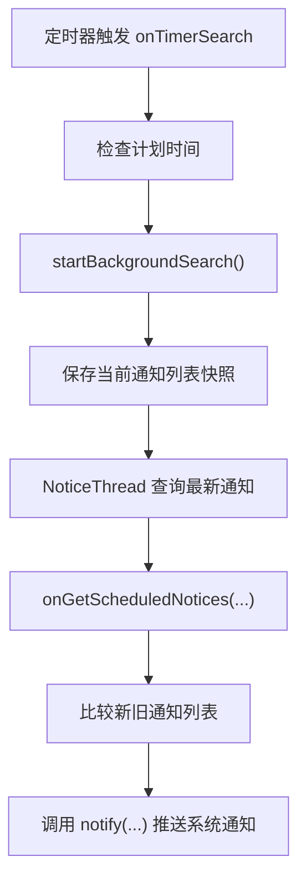

# 通知模块

`notification` 模块负责聚合校园官网通知，并按照用户订阅的网站和过滤规则筛选结果。它服务通知查询页面、通知设置页面和定时通知推送功能。

项目中还有一个名称相近的 `app/utils/notification.py`。它负责发送系统桌面弹窗，基于 `plyer.notification` 封装，与校园通知的数据抓取和过滤逻辑分属不同层次。

## 模块职责

`notification` 模块当前支持：

- 定义统一的通知数据对象。
- 管理通知来源枚举和来源 URL。
- 爬取教务处、研究生院、软件学院通知。
- 处理教务处和软件学院通知页的动态挑战。
- 按标题和标签筛选通知。
- 保存和加载订阅源、过滤规则和已获取通知。
- 为通知查询界面和定时通知推送提供数据。

通知查询无需登录统一认证，也无需使用账号密码。

## 代码位置

| 文件 | 职责 |
| --- | --- |
| `notification/notification.py` | `Notification` 数据对象 |
| `notification/source.py` | 通知来源枚举与来源 URL |
| `notification/filter.py` | 标题和标签过滤器 |
| `notification/ruleset.py` | 规则组 |
| `notification/notification_manager.py` | 订阅、筛选、加载和保存 |
| `notification/crawlers/crawler.py` | 爬虫基类、动态挑战、User-Agent 与 `client_id` 缓存 |
| `notification/crawlers/jwc.py` | 教务处通知爬虫 |
| `notification/crawlers/gs.py` | 研究生院通知爬虫 |
| `notification/crawlers/se.py` | 软件学院通知爬虫 |
| `app/threads/NoticeThread.py` | 通知查询后台线程 |
| `app/sub_interfaces/NoticeInterface.py` | 通知查询主界面 |
| `app/sub_interfaces/NoticeSettingInterface.py` | 订阅源和过滤规则设置入口 |
| `app/utils/notification.py` | 系统桌面通知发送包装 |

## 通知数据模型

`Notification` 表示校园官网上的一条通知。

| 字段 | 含义 |
| --- | --- |
| `title` | 通知标题 |
| `link` | 通知详情页链接 |
| `source` | 来源网站，对应 `Source` 枚举 |
| `description` | 通知描述，当前通常为空 |
| `tags` | 通知标签集合 |
| `date` | 发布日期 |
| `is_read` | 用户是否已读 |

`tags` 在对象内部使用 `set` 存储，保存到 JSON 时通过 `dump()` 转成列表。`date` 保存为 ISO 日期字符串，加载时通过 `datetime.date.fromisoformat()` 还原。

两条通知的相等性由标题、链接和来源共同决定：

```python
self.title == other.title and self.link == other.link and self.source == other.source
```

这个规则用于爬虫去重、界面合并新通知和定时查询判断新通知。

## 通知来源

`Source` 枚举定义当前支持的通知来源。

| 枚举 | 官网 | 用途 |
| --- | --- | --- |
| `Source.JWC` | `dean.xjtu.edu.cn` | 教务处通知 |
| `Source.GS` | `gs.xjtu.edu.cn` | 研究生院通知 |
| `Source.SE` | `se.xjtu.edu.cn` | 软件学院通知 |

`SOURCE_URL_MAP` 保存来源到官网通知页的映射，`get_source_url(source)` 返回某个来源的通知页面地址。设置界面可以用这些信息展示订阅源。

## 爬虫结构

所有通知爬虫继承 `Crawler` 基类。

| 成员 | 用途 |
| --- | --- |
| `pages` | 抓取页数 |
| `get_notifications(clear_repeat=True)` | 返回 `list[Notification]` |

`clear_repeat=True` 时，爬虫会按 `Notification.__eq__()` 清理重复通知。

当前爬虫实现如下：

| 爬虫 | 来源 | 解析内容 |
| --- | --- | --- |
| `JWC` | 教务处 | 标题、链接、日期、标签 |
| `GS` | 研究生院 | 标题、链接、日期、子栏目标签 |
| `SE` | 软件学院 | 标题、链接、日期 |

`JWC` 和 `SE` 会先调用 `pass_challenge_for_website()` 获取可访问通知页的 session，再解析页面。`GS` 会聚合研究生院多个子栏目，包括招生工作、培养工作、国际交流、学位工作、研工工作和综合工作，并把栏目名作为通知标签。

## 动态挑战与 client_id 缓存

教务处和软件学院通知页可能返回动态挑战页面。相关逻辑位于 `notification/crawlers/crawler.py`。

| 函数 | 用途 |
| --- | --- |
| `pass_challenge_for_website()` | 创建 session、完成动态挑战并返回可访问通知页的 session |
| `extract_challenge_id_from_html()` | 从挑战页面脚本中提取 `challengeId` 和 `answer` |
| `generate_user_agent()` | 按当前系统生成随机浏览器 User-Agent |
| `get_system_platform()` | 生成类似浏览器 `navigator.platform` 的平台字符串 |
| `get_client_id()` | 读取缓存的 `client_id` |
| `set_client_id()` | 保存新的 `client_id` |

挑战流程会模拟浏览器信息提交 `answer`、`challenge_id` 和 `browser_info`。服务端返回新的 `client_id` 时，代码会写入 session cookie，并通过 `cacheManager.write_expire_json("client_id.json", ...)` 缓存。缓存有效期按 1 天处理。

维护这部分时，重点检查挑战页脚本中的 `challengeId` 和 `answer` 赋值格式，以及服务端挑战接口是否仍返回 `client_id`。

## 过滤器

过滤器定义在 `notification/filter.py`。`Filter` 抽象接口约定了四个方法：

| 方法 | 用途 |
| --- | --- |
| `__call__(notification)` | 判断一条通知是否通过过滤条件 |
| `dump()` | 保存过滤器配置 |
| `load(config)` | 从配置恢复过滤器 |
| `stringify()` | 生成界面展示文本 |

当前过滤器包括：

| 过滤器 | 含义 |
| --- | --- |
| `TitleIncludeFilter` | 标题包含指定文本 |
| `TitleExcludeFilter` | 标题排除指定文本 |
| `TagIncludeFilter` | 标签包含指定文本 |
| `TagExcludeFilter` | 标签排除指定文本 |

过滤器通过 `CLASS_NAME` 和 `NAME_CLASS` 在类和配置名称之间转换。新增过滤器时，需要同时更新这两个映射，否则配置无法正确保存和加载。

`TagExcludeFilter` 当前实现了与 `Filter` 相同的接口，并通过 `NAME_CLASS` 参与配置加载。

## 规则组

`Ruleset` 是一组过滤器的集合。

| 字段 | 含义 |
| --- | --- |
| `filters` | 过滤器列表 |
| `name` | 规则名称，主要供 GUI 展示 |
| `enable` | 是否启用该规则组 |

规则组内部是“且”关系：一条通知需要满足该规则组中的所有过滤器。`Ruleset.__call__()` 会逐个调用过滤器，只要有一个过滤器未通过，该通知就不会通过这一组规则。

同一个来源下可以配置多个规则组。规则组之间是“或”关系：通知满足任一启用规则组即可保留。

## NotificationManager

`NotificationManager` 是通知模块的核心协调类。它管理两类状态：

| 字段 | 含义 |
| --- | --- |
| `subscription` | 已订阅来源集合，类型为 `set[Source]` |
| `ruleset` | 每个来源对应的规则组列表，类型为 `dict[Source, list[Ruleset]]` |

主要方法：

| 方法 | 用途 |
| --- | --- |
| `add_subscription(source, ruleset=None)` | 添加订阅源 |
| `remove_subscription(source, remove_ruleset=True)` | 移除订阅源 |
| `add_ruleset(source, ruleset)` | 为来源添加规则组 |
| `remove_ruleset(source, ruleset)` | 移除单个规则组 |
| `remove_rulesets(source)` | 移除某来源的所有规则组 |
| `get_notifications(pages=1)` | 抓取订阅源通知并按规则筛选 |
| `get_new_notifications(notifications, pages=1)` | 返回已有列表之外的新通知 |
| `filter_notifications(notifications, clear_other_notice=True)` | 对已有通知列表重新筛选 |
| `satisfy_filter(notification, clear_other_notice=True)` | 判断单条通知是否满足当前订阅和规则 |
| `dump_config()` | 保存订阅源和过滤规则配置 |
| `load_or_create(data=None)` | 从配置创建管理器 |
| `dump_notifications(notifications)` | 保存通知列表 |
| `load_notifications(data)` | 从字典列表恢复通知对象 |

筛选规则如下：

- 来源未配置规则组时，该来源的通知全部保留。
- 来源配置了规则组且所有规则组都处于停用状态时，该来源的通知全部保留。
- 来源配置了启用规则组时，通知满足任一启用规则组即可保留。

## 配置与缓存

通知界面会保存两类数据。

| 文件 | 读写位置 | 内容 |
| --- | --- | --- |
| `notification_config.json` | `dataManager` | 订阅源和过滤规则配置 |
| `notification.json` | `cacheManager` | 已获取通知和已读状态 |

`NoticeInterface.load_or_create_manager()` 会从 `notification_config.json` 加载 `NotificationManager`。配置缺失或 JSON 解析失败时，会创建空的 `NotificationManager`。

`save_manager()` 会调用 `NotificationManager.dump_config()` 保存订阅和规则。用户退出通知设置界面时，`onSettingQuit()` 会保存 manager，并用 `satisfy_filter()` 重新过滤已获取通知。

`save_notification()` 会调用 `NotificationManager.dump_notifications()` 保存已获取通知列表。通知已读状态变化、排序变化、点击通知和获取新通知后都会重新保存。

## 查询线程

`NoticeThread` 位于 `app/threads/NoticeThread.py`，用于在后台执行通知抓取。

| 成员 | 用途 |
| --- | --- |
| `notice_manager` | 当前通知管理器 |
| `pages` | 本次抓取页数 |
| `notices` | 查询成功后发出的 `pyqtSignal(list)` |

`run()` 会设置进度状态，然后调用 `notice_manager.get_notifications(pages=self.pages)`。网络连接错误、请求错误和其他异常会转成 `error` 与 `canceled` 信号；成功时发出 `notices` 和 `hasFinished`。

通知查询页面通过 `ProcessWidget` 包装 `NoticeThread`，因此用户可以看到查询进度，也可以取消正在执行的查询。

## 通知查询界面

`NoticeInterface` 是通知查询主界面。它负责加载配置、展示通知卡片、触发刷新和处理定时查询。

主要行为：

- 初始化时加载 `NotificationManager` 和历史通知。
- 没有订阅源时展示添加配置入口。
- 有订阅源且没有通知时展示手动获取入口。
- “立刻刷新”启动 `NoticeThread`。
- 首次刷新抓取 2 页，后续刷新抓取 1 页。
- `onGetNotices()` 合并新通知，并跳过已存在通知。
- 点击通知会将通知标记为已读，并通过 `QDesktopServices.openUrl()` 打开链接。
- “全部已读”会批量更新 `is_read` 并保存。
- 通知卡片按批次延迟加载，每 100 ms 加载一批，每批 5 条。

排序逻辑位于 `sort_notices()`。它会先按日期排序，再按来源排序，最后把未读通知排在已读通知之前。

## 订阅源和规则设置界面

通知设置界面由多个子界面组成。

| 类 | 用途 |
| --- | --- |
| `NoticeSettingInterface` | 设置界面容器，提供面包屑导航 |
| `NoticeChoiceInterface` | 选择订阅来源 |
| `NoticeRuleInterface` | 管理某个来源下的规则组列表 |
| `RuleSetInterface` | 编辑单条规则组 |
| `NoticeSourceCard` | 展示一个订阅源 |
| `NoticeRuleCard` | 展示一条规则组 |

`NoticeChoiceInterface` 会遍历 `Source` 枚举生成订阅源卡片。用户勾选来源时调用 `manager.add_subscription(source)`，取消勾选时调用 `manager.remove_subscription(source, remove_ruleset=False)`。这里会保留该来源已有规则，方便用户重新订阅后继续使用。

`NoticeSettingInterface.onSettingQuit()` 会在返回通知查询页时保存配置，并按新规则过滤当前已获取通知。

## 定时查询与系统通知

通知定时查询由 `NoticeInterface.onTimerSearch()` 触发。它会比较当前时间、`cfg.noticeSearchTime` 和 `cfg.lastSearchTime`：当天计划时间已到且上次查询早于计划时间时，调用 `startBackgroundSearch()`。

后台查询流程：



`onGetScheduledNotices()` 会把本次结果与 `_lastNotices` 比较，只统计新增通知。存在新通知时，会通过 `app/utils/notification.py` 中的 `notify()` 发送系统桌面通知；`force_push=True` 且没有新通知时，会发送“没有新的通知”的测试提醒。

`app/utils/notification.py` 默认调用 `plyer.notification.notify()`。在 macOS 开发环境中，`plyer` 可能因为 Python 解释器缺少应用包信息而无法发送通知，代码会用 AppleScript 作为兜底。

## 新增通知来源

如果要增加一个通知来源，可以按以下顺序修改：

1. 在 `notification/source.py` 的 `Source` 中增加枚举值。
2. 在 `SOURCE_URL_MAP` 中增加官网通知页 URL。
3. 在 `notification/crawlers/` 中新增爬虫类，继承 `Crawler`。
4. 在 `notification/crawlers/__init__.py` 的 `SOURCE_CRAWLER` 中注册来源到爬虫类的映射。
5. 确认爬虫返回的 `Notification` 包含标题、链接、来源、日期和必要标签。
6. 如果页面有动态挑战，评估是否可以复用 `pass_challenge_for_website()`。
7. 检查 `NoticeChoiceInterface` 中遍历 `Source` 后的订阅源展示效果。
8. 按需要补充用户手册中的来源说明。

新增过滤器时，需要实现 `Filter` 的四个接口，并同时更新 `CLASS_NAME` 和 `NAME_CLASS`。

## 维护注意事项

- 官网 HTML 结构变化时，优先检查对应爬虫中的 XPath。
- 教务处和软件学院动态挑战失效时，优先检查挑战页脚本、挑战接口和 `client_id` 缓存。
- 通知去重依赖标题、链接和来源，官网链接格式变化可能影响重复判断。
- 研究生院通知由多个栏目聚合，标签来自栏目名。
- 订阅配置和已获取通知分别由 `dataManager` 与 `cacheManager` 保存。
- 桌面弹窗发送位于 `app/utils/notification.py`，校园通知查询逻辑集中在 `notification/`。

## 继续阅读

- [子线程与进度反馈设计](./thread)：`NoticeThread` 如何通过 `ProcessThread` 向 GUI 汇报状态。
- [文档站维护](./docs-site)：开发文档页面和侧边栏维护方式。
- [通知查询用户手册](../tutorial/notice)：用户视角的通知订阅和筛选。
- [定时查询用户手册](../tutorial/scheduled-event)：定时通知推送与系统通知权限。
