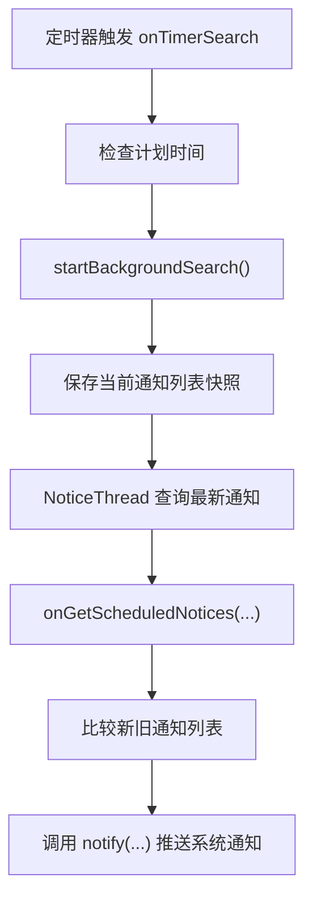

# 通知模块

`notification` 模块负责聚合校园官网通知，并按照用户订阅的网站和过滤规则筛选结果。它服务通知查询页面、通知设置页面和定时通知推送功能。

项目中还有一个名称相近的 `app/utils/notification.py`。它负责发送系统桌面弹窗，基于 `plyer.notification` 封装，与校园通知的数据抓取和过滤逻辑分属不同层次。

## 模块职责

`notification` 模块当前支持：

- 定义统一的通知数据对象。
- 管理 78 个声明式通知栏目、稳定来源 ID 和分类信息。
- 通过通用爬虫抓取校级部门、学院学部、书院和医学教育站点。
- 处理教务处和软件学院通知页的动态挑战。
- 按标题和标签筛选通知。
- 保存和加载订阅源、过滤规则和已获取通知。
- 为通知查询界面和定时通知推送提供数据。

通知查询无需登录统一认证，也无需使用账号密码。

## 代码位置

| 文件 | 职责 |
| --- | --- |
| `notification/notification.py` | `Notification` 数据对象 |
| `notification/source.py` | 来源注册表模型、校验与旧配置迁移 |
| `notification/sources.json` | 78 个栏目的稳定 ID、分类、URL 和声明式选择器 |
| `notification/filter.py` | 标题和标签过滤器 |
| `notification/ruleset.py` | 规则组 |
| `notification/notification_manager.py` | 订阅、筛选、加载和保存 |
| `notification/crawlers/crawler.py` | 爬虫基类、动态挑战、User-Agent 与 `client_id` 缓存 |
| `notification/crawlers/generic.py` | 通用 HTML/RSS/JSON 抓取、日期解析和配置驱动的详情页日期补全 |
| `notification/crawlers/jwc.py` | 教务处通知爬虫 |
| `notification/crawlers/gs.py` | 研究生院通知爬虫 |
| `notification/crawlers/se.py` | 软件学院通知爬虫 |
| `app/threads/NoticeThread.py` | 通知查询后台线程 |
| `app/sub_interfaces/NoticeInterface.py` | 通知查询主界面 |
| `app/sub_interfaces/NoticeSettingInterface.py` | 订阅源和过滤规则设置入口 |
| `app/utils/notification.py` | 系统桌面通知发送包装 |

## 通知数据模型

`Notification` 表示校园官网上的一条通知。

| 字段 | 含义 |
| --- | --- |
| `title` | 通知标题 |
| `link` | 通知详情页链接 |
| `source` | 稳定来源 ID，例如 `dean/jxtz` |
| `description` | 通知描述，当前通常为空 |
| `tags` | 通知标签集合 |
| `date` | 发布日期 |
| `is_read` | 用户是否已读 |

`tags` 在对象内部使用 `set` 存储，保存到 JSON 时通过 `dump()` 转成列表。`date` 保存为 ISO 日期字符串，加载时通过 `datetime.date.fromisoformat()` 还原。

两条通知的相等性由标题、链接和来源共同决定：

```python
self.title == other.title and self.link == other.link and self.source == other.source
```

这个规则用于爬虫去重、界面合并新通知和定时查询判断新通知。

## 通知来源

`notification/sources.json` 定义当前来源目录。每个可独立订阅的栏目拥有稳定的
`site_id/channel_id` ID；中文显示名、URL、分类、适用学生层次、验证状态和解析选择器与 ID 分离。
`SourceRegistry` 负责加载与校验，`get_source_name()` 和 `get_source_url()` 负责界面显示。
旧 `Source.JWC/GS/SE` 仅作为兼容常量保留，新代码应直接使用字符串 ID。

站点可用可选的 `placements` 声明多个目录展示位置。例如钱学森学院在“学院与学部 / 工学”下
保留主项，同时以“钱学森书院”显示在书院目录；两个 UI 项引用同一个 `bjb/tzgg`，勾选状态
双向同步，抓取、规则和持久化均不会复制。当前书院目录因此覆盖官网 9 个机构，但仍只有 8 个
唯一站点和 8 个独立频道。

注册表在加载阶段严格校验 ID、HTTP(S) URL、状态、学生层次、学院学科、爬虫类型、核验日期、
标签、目录位置及重复项、选择器字段、详情请求上限和 XPath 语法。带凭据 URL、未知字段、非法 XPath、错误学科或
未配详情选择器却设置详情请求上限都会立即报出配置错误，避免问题延迟到用户在线抓取时才出现。

## 爬虫结构

所有通知爬虫继承 `Crawler` 基类。

| 成员 | 用途 |
| --- | --- |
| `pages` | 抓取页数 |
| `get_notifications(clear_repeat=True)` | 返回 `list[Notification]` |

`clear_repeat=True` 时，爬虫会按 `Notification.__eq__()` 清理重复通知。

来源统一由 `GenericListCrawler` 调度。它支持 XJTU CMS 启发式 HTML 解析、注册表声明式 XPath、
RSS 与 JSON 四种形式，并覆盖完整日期、年月+日、月日+年和英文月份日期。声明了
`needs_challenge` 的站点会复用 `pass_challenge_for_website()`。研究生院六个子栏目现在是六个独立
feed，栏目名作为默认标签保留。

英文月份使用模块内静态月份映射，`08/03 2026` 等数字混合格式也按明确的月/日/年规则解析，
不调用依赖进程 `LC_TIME` 的 `strptime`。这是必要约束：Qt 创建 `QApplication` 时可能改变全局
locale；日期解析必须在源码测试环境和真实 GUI 进程中保持相同结果，也不能通过临时切换全局
locale 引入线程竞态。

若列表页只显示月日，可在注册表声明 `detail_date_xpath`。通用爬虫会使用同一 session
、受限请求数和同源校验读取详情页；任何详情失败只跳过当前条目，不会猜测年份。
崇实书院即使用此通用能力，Python 代码中没有站点 ID 或 URL 特判。

## 动态挑战与 client_id 缓存

教务处和软件学院通知页可能返回动态挑战页面。相关逻辑位于 `notification/crawlers/crawler.py`。

| 函数 | 用途 |
| --- | --- |
| `pass_challenge_for_website()` | 创建 session、完成动态挑战并返回可访问通知页的 session |
| `extract_challenge_id_from_html()` | 从挑战页面脚本中提取 `challengeId`，并读取或计算 `answer` |
| `javascript_simple_hash()` | 使用 Python 复现挑战页面的 JavaScript 32 位哈希 |
| `generate_user_agent()` | 按当前系统生成随机浏览器 User-Agent |
| `get_system_platform()` | 生成类似浏览器 `navigator.platform` 的平台字符串 |
| `get_client_id()` | 读取缓存的 `client_id` |
| `set_client_id()` | 保存新的 `client_id` |

挑战流程兼容新旧两种页面：旧版直接读取 `answer`，新版读取 `a`、`b` 和 `operator` 后计算答案，并提交与页面一致的 `hash` 和浏览器信息。服务端返回新的 `client_id` 时，代码会写入 session cookie，并通过 `cacheManager.write_expire_json("client_id.json", ...)` 缓存。缓存有效期按 1 天处理。

维护这部分时，重点检查挑战页脚本中的 `challengeId`、算式变量和哈希格式，以及服务端挑战接口是否仍返回 `success` 与 `client_id`。

## 过滤器

过滤器定义在 `notification/filter.py`。`Filter` 抽象接口约定了四个方法：

| 方法 | 用途 |
| --- | --- |
| `__call__(notification)` | 判断一条通知是否通过过滤条件 |
| `dump()` | 保存过滤器配置 |
| `load(config)` | 从配置恢复过滤器 |
| `stringify()` | 生成界面展示文本 |

当前过滤器包括：

| 过滤器 | 含义 |
| --- | --- |
| `TitleIncludeFilter` | 标题包含指定文本 |
| `TitleExcludeFilter` | 标题排除指定文本 |
| `TagIncludeFilter` | 标签包含指定文本 |
| `TagExcludeFilter` | 标签排除指定文本 |

过滤器通过 `CLASS_NAME` 和 `NAME_CLASS` 在类和配置名称之间转换。新增过滤器时，需要同时更新这两个映射，否则配置无法正确保存和加载。

`TagExcludeFilter` 当前实现了与 `Filter` 相同的接口，并通过 `NAME_CLASS` 参与配置加载。

## 规则组

`Ruleset` 是一组过滤器的集合。

| 字段 | 含义 |
| --- | --- |
| `filters` | 过滤器列表 |
| `name` | 规则名称，主要供 GUI 展示 |
| `enable` | 是否启用该规则组 |

规则组内部是“且”关系：一条通知需要满足该规则组中的所有过滤器。`Ruleset.__call__()` 会逐个调用过滤器，只要有一个过滤器未通过，该通知就不会通过这一组规则。

同一个来源下可以配置多个规则组。规则组之间是“或”关系：通知满足任一启用规则组即可保留。

## NotificationManager

`NotificationManager` 是通知模块的核心协调类。它管理两类状态：

| 字段 | 含义 |
| --- | --- |
| `subscription` | 有序来源 ID 列表，类型为 `list[str]` |
| `ruleset` | 每个来源 ID 对应的规则组列表，类型为 `dict[str, list[Ruleset]]` |
| `last_errors` | 最近一轮逐来源抓取错误，类型为 `dict[str, str]` |

主要方法：

| 方法 | 用途 |
| --- | --- |
| `add_subscription(source, ruleset=None)` | 添加订阅源 |
| `remove_subscription(source, remove_ruleset=True)` | 移除订阅源 |
| `add_ruleset(source, ruleset)` | 为来源添加规则组 |
| `remove_ruleset(source, ruleset)` | 移除单个规则组 |
| `remove_rulesets(source)` | 移除某来源的所有规则组 |
| `get_notifications(pages=1)` | 抓取订阅源通知并按规则筛选 |
| `get_new_notifications(notifications, pages=1)` | 返回已有列表之外的新通知 |
| `filter_notifications(notifications, clear_other_notice=True)` | 对已有通知列表重新筛选 |
| `satisfy_filter(notification, clear_other_notice=True)` | 判断单条通知是否满足当前订阅和规则 |
| `dump_config()` | 保存订阅源和过滤规则配置 |
| `load_or_create(data=None)` | 从配置创建管理器 |
| `dump_notifications(notifications)` | 保存通知列表 |
| `load_notifications(data)` | 从字典列表恢复通知对象 |

筛选规则如下：

- 来源未配置规则组时，该来源的通知全部保留。
- 来源配置了规则组且所有规则组都处于停用状态时，该来源的通知全部保留。
- 来源配置了启用规则组时，通知满足任一启用规则组即可保留。

## 配置与缓存

通知界面会保存两类数据。

| 文件 | 读写位置 | 内容 |
| --- | --- | --- |
| `notification_config.json` | `dataManager` | 订阅源和过滤规则配置 |
| `notification.json` | `cacheManager` | 已获取通知和已读状态 |

`NoticeInterface.load_or_create_manager()` 会从 `notification_config.json` 加载 `NotificationManager`。配置缺失或 JSON 解析失败时，会创建空的 `NotificationManager`。

`save_manager()` 会调用 `NotificationManager.dump_config()` 保存订阅和规则。用户退出通知设置界面时，`onSettingQuit()` 会保存 manager，并用 `satisfy_filter()` 重新过滤已获取通知。

`save_notification()` 会调用 `NotificationManager.dump_notifications()` 保存已获取通知列表。通知已读状态变化、排序变化、点击通知和获取新通知后都会重新保存。

## 查询线程

`NoticeThread` 位于 `app/threads/NoticeThread.py`，用于在后台执行通知抓取。

| 成员 | 用途 |
| --- | --- |
| `notice_manager` | 当前通知管理器 |
| `pages` | 本次抓取页数 |
| `notices` | 查询成功后发出的 `pyqtSignal(list)` |

`run()` 会设置进度状态，然后调用 `notice_manager.get_notifications(pages=self.pages)`。网络连接错误、请求错误和其他异常会转成 `error` 与 `canceled` 信号；成功时发出 `notices` 和 `hasFinished`。

通知查询页面通过 `ProcessWidget` 包装 `NoticeThread`，因此用户可以看到查询进度，也可以取消正在执行的查询。

## 通知查询界面

`NoticeInterface` 是通知查询主界面。它负责加载配置、展示通知卡片、触发刷新和处理定时查询。

主要行为：

- 初始化时加载 `NotificationManager` 和历史通知。
- 没有订阅源时展示添加配置入口。
- 有订阅源且没有通知时展示手动获取入口。
- “立刻刷新”启动 `NoticeThread`。
- 首次刷新抓取 2 页，后续刷新抓取 1 页。
- `onGetNotices()` 合并新通知，并跳过已存在通知。
- 点击通知会将通知标记为已读，并通过 `QDesktopServices.openUrl()` 打开链接。
- “全部已读”会批量更新 `is_read` 并保存。
- 通知卡片按批次延迟加载，每 100 ms 加载一批，每批 5 条。

排序逻辑位于 `sort_notices()`。它会先按日期排序，再按来源排序，最后把未读通知排在已读通知之前。

## 订阅源和规则设置界面

通知设置界面由多个子界面组成。

| 类 | 用途 |
| --- | --- |
| `NoticeSettingInterface` | 设置界面容器，提供面包屑导航 |
| `NoticeChoiceInterface` | 选择订阅来源 |
| `NoticeRuleInterface` | 管理某个来源下的规则组列表 |
| `RuleSetInterface` | 编辑单条规则组 |
| `NoticeSourceCard` | 展示一个订阅源 |
| `NoticeRuleCard` | 展示一条规则组 |

`NoticeChoiceInterface` 使用 qfluentwidgets 的 `SearchLineEdit` 和 `TreeWidget`，在“西安交通大学”下按
“校级部门 / 学院与学部 / 书院 / 医学教育”展示；学院与学部再分为“工学 / 理学 /
人文经管”。站点父项支持 checked / partially checked / unchecked 三态，可对所有子栏目全选或全清。
首次进入时仅“西安交通大学”根目录默认展开；类别、学科和站点子目录默认收起，搜索命中时再展开匹配路径。
搜索栏位于树滚动区之外，展开或折叠不会改变页面关键几何。用户勾选来源时调用
`manager.add_subscription(source_id)`，取消勾选时调用
`manager.remove_subscription(source_id, remove_ruleset=False)`。待核验来源保留官网入口但不可勾选。

`NoticeInterface` 同样使用 `app/search.py` 的归一化、连续字符串和受限子序列匹配，可按标题、来源、
标签与日期查找。来源选择和通知列表共用同一搜索实现。

`NoticeSettingInterface.onSettingQuit()` 会在返回通知查询页时保存配置，并按新规则过滤当前已获取通知。

## 定时查询与系统通知

通知定时查询由 `NoticeInterface.onTimerSearch()` 触发。它会比较当前时间、`cfg.noticeSearchTime` 和 `cfg.lastSearchTime`：当天计划时间已到且上次查询早于计划时间时，调用 `startBackgroundSearch()`。

后台查询流程：


```mermaid
flowchart TD
    A["定时器触发 onTimerSearch"] --> B["检查计划时间"]
    B --> C["startBackgroundSearch()"]
    C --> D["保存当前通知列表快照"]
    D --> E["NoticeThread 查询最新通知"]
    E --> F["onGetScheduledNotices(...)"]
    F --> G["比较新旧通知列表"]
    G --> H["调用 notify(...) 推送系统通知"]
```

`onGetScheduledNotices()` 会把本次结果与 `_lastNotices` 比较，只统计新增通知。存在新通知时，会通过 `app/utils/notification.py` 中的 `notify()` 发送系统桌面通知；`force_push=True` 且没有新通知时，会发送“没有新的通知”的测试提醒。

`app/utils/notification.py` 默认调用 `plyer.notification.notify()`。在 macOS 开发环境中，`plyer` 可能因为 Python 解释器缺少应用包信息而无法发送通知，代码会用 AppleScript 作为兜底。

## 新增通知来源

如果要增加一个通知来源：

1. 在 `notification/sources.json` 对应机构的 `channels` 中登记稳定 ID、真实栏目名与官方 URL。
2. 新栏目先标为 `status: "candidate"` 并填写 `checked_on`；若是 XJTU 站点，按实际情况设置 `needs_challenge`。
3. 通用启发式无法定位时，在该 channel 中添加 `item_xpath/link_xpath/title_xpath/date_xpath` 等声明式选择器。
   列表不含年份时可再添加 `detail_date_xpath`、`detail_date_max` 和 `detail_date_retries`，不得用当前年推测。
4. 运行 `python -m scripts.smoke_notification_sources --include-unverified <source-id>`。
5. 只有至少成功抽取一条标题、日期、链接后，才把状态改为 `verified`；若栏目 HTTP 正常但列表区确实没有内容，则标为 `empty`，不要伪装成抓取失败或已验证有内容。
6. 运行通知模块单元测试，并确认新来源默认不开启；新增数据会由 `build.py` 一并打包。

本次相关回归的可复现命令：

```bash
XDG_STATE_HOME=/tmp/xjtu-test-state \
XDG_CONFIG_HOME=/tmp/xjtu-test-config \
XDG_DATA_HOME=/tmp/xjtu-test-data \
QT_QPA_PLATFORM=offscreen \
python -m test.ci.run_test_regressions

python -m scripts.smoke_notification_sources --workers 8
```

回归模块由各测试文件中的 `TEST_REGRESSION = True` 标记自动发现；新增或调整回归测试时只需修改
对应测试文件，不要在本文档维护模块列表。本命令现在统一运行 CI 标记的 6 个历史回归模块；此前
文档命令额外包含的 `test_ai_core`、`test_ctrl_c`、`test_qrcode_login` 不再由此命令单独运行，
而 `test_notice_thread`、`test_schedule_lesson` 已纳入统一入口。若需核对当前集合，请运行
`python -m test.ci.check_test_contract --format markdown`。

全仓发现应显式指定顶层目录：`python -m unittest discover -s test -t .`。只写
`python -m unittest discover -s test` 可能让测试子包遮蔽产品同名包。

新增过滤器时，需要实现 `Filter` 的四个接口，并同时更新 `CLASS_NAME` 和 `NAME_CLASS`。

## 维护注意事项

- 官网 HTML 结构变化时，先运行逐源 smoke，再检查注册表选择器和通用容器启发式。
- XJTU 动态挑战失效时，优先检查挑战页脚本、挑战接口和 `client_id` 缓存。
- 通知去重依赖标题、链接和来源，官网链接格式变化可能影响重复判断。
- 研究生院栏目可独立订阅，标签来自注册表中的栏目配置。
- 订阅配置和已获取通知分别由 `dataManager` 与 `cacheManager` 保存。
- 桌面弹窗发送位于 `app/utils/notification.py`，校园通知查询逻辑集中在 `notification/`。

## 继续阅读

- [子线程与进度反馈设计](./thread)：`NoticeThread` 如何通过 `ProcessThread` 向 GUI 汇报状态。
- [文档站维护](./docs-site)：开发文档页面和侧边栏维护方式。
- [通知查询用户手册](../tutorial/notice)：用户视角的通知订阅和筛选。
- [定时查询用户手册](../tutorial/scheduled-event)：定时通知推送与系统通知权限。
