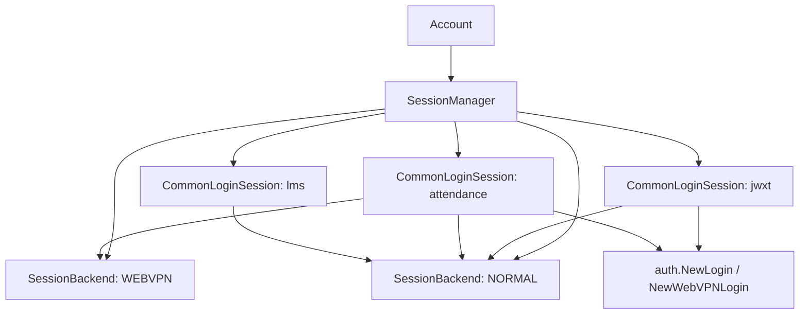
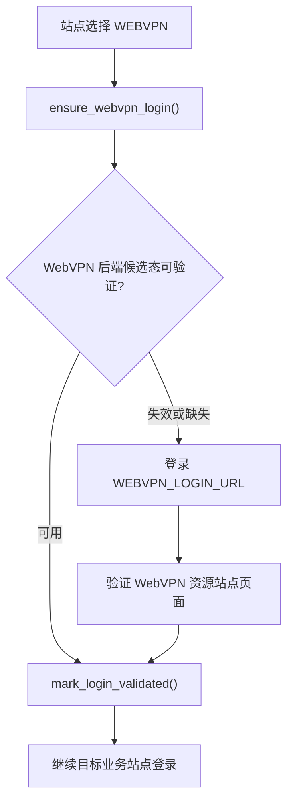
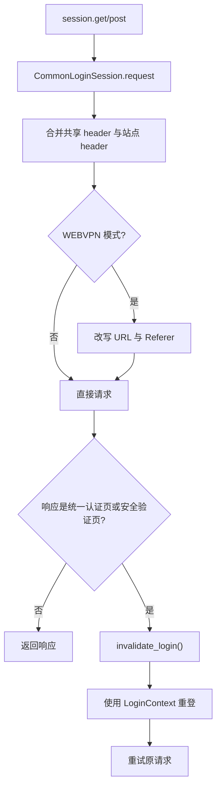

# Session 管理设计

Session 管理层负责在 GUI 程序中复用登录态。它把“某个账号访问某个站点”的运行时状态集中到账号自己的 `SessionManager` 中，让课表、成绩、评教、考勤、LMS 等功能共享同一套登录认证 cookie。

如果没有 Session 管理层，每个模块都要自己处理登录认证；而且，如果有两个模块访问同一个系统却不共享登录凭证，它们可能会互相让对方掉线，导致连接很不稳定。

如果你想增加一个网站的支持，可以先阅读 [新增一个站点 Session](#新增一个站点-session)。该节给出最短接入路径；遇到 `SessionBackend`、`AccessMode`、`validate_login()` 等概念时，再回到前面的设计章节补充上下文。

## 设计目标

Session 管理层主要解决以下问题：

- 同一账号下，各功能共用对应站点的登录态。
- 同一业务站点只创建一个站点 Session 实例。
- 普通访问与 WebVPN 访问分别维护底层请求后端。
- 共享 cookie 与站点专用 header 分层保存。
- MFA 与二维码登录交互由 GUI provider 注入。
- 程序退出时可以保存登录态，启动后恢复候选态并延迟验证。

## 整体结构

Session 管理层由三类对象组成：

| 层次 | 类型 | 职责 |
| --- | --- | --- |
| 管理层 | `SessionManager` | 注册、创建、复用、切换、持久化所有站点 Session |
| 后端层 | `SessionBackend` | 保存底层 `requests.Session`、cookie、共享登录状态 |
| 站点层 | `CommonLoginSession` 子类 | 处理某个业务系统的登录、验证、专用 header 与请求 |



`SessionManager` 按账号存在。每个账号拥有自己的 `SessionManager`，因此多账户之间的 cookie、站点 header、访问方式缓存和持久化快照互相隔离。

## 账号与 SessionManager

`Account` 初始化时会创建一个 `SessionManager`。GUI 代码通常通过当前账号访问站点 Session：

```python
session = accounts.current.session_manager.get_session("jwxt")
```

主窗口启动时会调用 `registerSession()` 注册所有内置站点 Session 类。当前注册的站点包括：

- `jwxt`：本科教务系统
- `attendance`：考勤系统
- `jwapp`：移动教务
- `gmis`：研究生管理信息系统
- `gste`：研究生评教系统
- `lms`：思源学堂

主窗口还会把 MFA provider 与二维码 provider 安装到每个账号的 `SessionManager`。后续登录时，站点 Session 可以通过当前账号拿到 GUI 交互能力。

## 注册与懒加载

`SessionManager` 支持两种注册方式：

| 方法 | 范围 | 使用场景 |
| --- | --- | --- |
| `SessionManager.global_register()` | 所有 `SessionManager` 实例 | 主窗口注册内置站点 |
| `SessionManager.register()` | 当前 `SessionManager` 实例 | 针对单个账号的局部扩展 |

注册时传入的是 `CommonLoginSession` 子类，而实例由 `get_session(name)` 懒加载创建。

```python
SessionManager.global_register(JWXTSession, "jwxt")
session = account.session_manager.get_session("jwxt")
```

`get_session()` 的行为：

1. 根据名称查找已注册的站点 Session 类。
2. 首次调用时创建实例。
3. 后续调用返回同一个实例。
4. 如果存在延迟恢复的站点快照，在实例创建后恢复。

这种方式让某个站点只有在用户实际使用相关功能时才创建，同时保证同一账号内不会重复创建同站点 Session。

## SessionBackend

`SessionBackend` 是同一账号、同一访问方式下共享的底层请求后端。`SessionManager` 固定维护两个 backend：

- `AccessMode.NORMAL`
- `AccessMode.WEBVPN`

每个 backend 保存：

| 字段 | 含义 |
| --- | --- |
| `session` | 底层 `requests.Session` |
| `session.cookies` | `LWPCookieJar` cookie 容器 |
| `has_login` | 该后端存在登录态候选 |
| `webvpn_has_login` | WebVPN 后端已验证登录 WebVPN 本身 |
| `restored_auth_candidate` | 从持久化快照恢复、等待验证的候选态 |
| `login_lock` | 控制同一后端的登录并发 |

共享 cookie、User-Agent、WebVPN 登录状态位于 `SessionBackend`。站点专用 token/header 位于站点 Session 的 `headers` 字段。

## CommonLoginSession

`CommonLoginSession` 是所有业务站点 Session 的基类。它继承了 `requests.Session` 风格的 `get()`、`post()`、`request()` 调用体验，同时增加站点登录、访问方式选择、WebVPN 改写与失效重登逻辑。

站点子类常用字段：

| 字段 | 含义 |
| --- | --- |
| `site_key` | 站点唯一标识 |
| `site_name` | 展示给用户的名称 |
| `default_access_mode` | 默认访问方式 |
| `supports_webvpn` | 站点支持 WebVPN 访问 |
| `use_webvpn_when_off_campus` | 自动探测为校外时使用 WebVPN |

站点子类常用方法：

| 方法 | 职责 |
| --- | --- |
| `_login()` | 具体站点登录流程 |
| `_re_login()` | 重新登录流程，通常复用 `_login()` |
| `validate_login()` | 访问轻量接口，验证站点登录态是否可用 |
| `ensure_login()` | 选择访问方式、验证现有登录态、必要时登录 |
| `request()` | 合并 header、改写 WebVPN URL、处理登录态失效 |
| `clear_site_state()` | 清理站点专用状态 |
| `to_site_snapshot()` | 导出站点专用快照 |
| `restore_site_snapshot()` | 恢复站点专用快照 |

站点 Session 的 `headers` 用于保存站点专用认证信息。例如考勤系统登录后会保存 `Synjones-Auth`。

## 访问方式选择

站点访问方式由 `AccessMode` 表示：

| 访问方式 | 含义 |
| --- | --- |
| `NORMAL` | 直接访问目标校内系统 |
| `WEBVPN` | 通过 WebVPN 改写目标地址 |

用户配置提供三种策略：

| 用户设置 | 行为 |
| --- | --- |
| 强制直连 | 使用 `AccessMode.NORMAL` |
| 强制 WebVPN | 支持 WebVPN 的站点使用 `AccessMode.WEBVPN` |
| 自动判断 | 探测校园网可达性，再结合站点策略选择 |

自动判断会访问考勤系统入口来推断当前网络是否可以直连校内系统。探测结果会缓存 5 分钟。站点可以通过两个字段影响自动策略：

- `supports_webvpn`：站点具备 WebVPN 访问路径。
- `use_webvpn_when_off_campus`：自动探测为校外网络时切换到 WebVPN。

访问策略变化时，`handle_access_policy_changed()` 会清理访问方式相关的站点状态，并保留可验证的 WebVPN backend 候选态。

## WebVPN 后端登录

WebVPN 访问包含两层登录态：

| 层次 | 保存位置 | 含义 |
| --- | --- | --- |
| WebVPN 后端登录态 | `SessionBackend(WEBVPN)` | 当前账号已经登录 WebVPN 本身 |
| 业务站点登录态 | `CommonLoginSession` 子类 | 当前账号已经通过 WebVPN 登录目标业务系统 |

当站点选择 `AccessMode.WEBVPN` 时，`CommonLoginSession._ensure_webvpn_backend_login()` 会要求 `SessionManager` 先确保 WebVPN 后端已经登录。

流程如下：



登录 WebVPN 本身使用普通统一认证入口 `NewLogin(WEBVPN_LOGIN_URL)` 或 `NewQRCodeLogin(WEBVPN_LOGIN_URL)`。目标业务系统通过 WebVPN 登录时，站点 Session 会选择 `NewWebVPNLogin` 或对应二维码登录器。

## 请求流程与自动重登

`CommonLoginSession.request()` 是站点请求的统一入口。它会执行以下步骤：

1. 刷新站点和 backend 的最近请求时间。
2. 合并 backend 公共 headers、站点专用 `headers` 与本次请求 headers。
3. 在 WebVPN 模式下改写目标 URL。
4. 在 WebVPN 模式下改写 `Referer` header。
5. 发起底层请求。
6. 判断响应是否表示站点登录态失效。
7. 需要时使用最近一次 `LoginContext` 原地重登并重试请求。



`_skip_auth_check=True` 用于登录态验证请求。验证逻辑需要直接观察响应内容，因此会跳过自动重登判断。

## MFA 与二维码 provider

GUI 交互能力通过 provider 注入到 Session 管理层：

- `SessionManager.set_mfa_provider()`
- `SessionManager.set_qrcode_login_provider()`

登录时，`CommonLoginSession.perform_cas_login()` 会根据配置选择用户名密码登录或二维码登录：

- 启用二维码登录时调用 `login_with_qrcode()`。
- 使用用户名密码登录时调用 `login_with_optional_mfa()`。

provider 会从登录参数、账号对象或当前 `SessionManager` 中取得。站点 Session 只需要提供登录器工厂和站点展示信息。

## 登录态持久化

登录态持久化位于 `app/utils/session_persistence.py`。它保存账号级快照，由三个数据结构组成：

| 快照 | 内容 |
| --- | --- |
| `BackendSnapshot` | backend cookie、User-Agent、loginId、保存时间 |
| `SiteSnapshot` | 站点 key、访问方式、站点专用 headers |
| `AccountSessionSnapshot` | 一个账号下所有 backend 和站点快照 |

cookie 会以 LWP 文本格式保存。快照文件支持使用 keyring 中的 AES-256-GCM 密钥加密。加密时会把账号 UUID、用途和文件名作为认证上下文，帮助避免不同账号或不同文件之间的快照混用。

恢复流程强调“候选态”：

1. 启动时读取账号快照。
2. 恢复 NORMAL 与 WEBVPN 两个 backend。
3. 将站点快照放入 `_pending_site_snapshots`。
4. 某站点首次创建时恢复该站点 headers。
5. 后续通过 `validate_login()` 或 WebVPN 验证后标记为有效。

当 User-Agent 或 loginId 与当前配置不一致时，backend 恢复会失败，SessionManager 会清理运行时状态并删除对应快照。

## 后台保活

后台保活由 `SessionManager.keep_alive_logged_in_sessions()` 驱动。它会收集当前已创建且 `has_login` 的站点 Session，并按访问方式处理。

WebVPN 站点的保活顺序：

1. 先执行 `keep_alive_webvpn_backend()` 验证 WebVPN 后端。
2. WebVPN 后端有效时，逐个调用站点 `keep_alive()`。
3. WebVPN 后端失效时，依赖 WebVPN 的站点统一标记为失效。

普通访问站点会直接调用各自的 `keep_alive()`。

保活结果通过 `KeepAliveReport` 和 `KeepAliveSiteResult` 表达。单个站点状态使用 `KeepAliveStatus`：

| 状态 | 含义 |
| --- | --- |
| `VALID` | 登录态有效 |
| `AUTH_INVALID` | 认证失效 |
| `NETWORK_ERROR` | 网络请求失败 |
| `BUSY` | 当前站点或 backend 正在登录或验证 |
| `ERROR` | 验证过程中发生其他错误 |
| `SKIPPED` | 当前站点没有登录态 |

## 清理与切换

Session 管理层区分运行时状态和持久化状态。

| 操作 | 影响 |
| --- | --- |
| `clear_runtime_session_state()` | 清理当前账号内存中的 backend 与站点状态 |
| `clear_persisted_session_state()` | 删除当前账号持久化快照 |
| `clear_all_session_state()` | 清理运行时状态，并可选删除持久化快照 |
| `handle_access_policy_changed()` | 清理访问方式相关站点状态并刷新探测缓存 |

站点状态和 backend 状态也有不同边界：

- `clear_site_state()` 清理站点专用 headers 与站点登录标记。
- `clear_backend_cookies()` 清理当前访问方式共享 backend 的 cookie，并清理当前站点状态。

## 新增一个站点 Session

新增站点支持时，优先为 GUI 层创建一个 `CommonLoginSession` 子类。它负责把底层认证系统接到当前站点，并提供登录态验证能力。

### 1. 创建站点 Session 类

在 `app/sessions/` 中新增文件，例如 `custom_session.py`：

```python
from __future__ import annotations

from auth import NewLogin, NewQRCodeLogin
from app.sessions.common_session import CommonLoginSession
from app.utils import cfg

CUSTOM_LOGIN_URL = "https://custom.xjtu.edu.cn/login"


class CustomSession(CommonLoginSession):
    site_key = "custom"
    site_name = "自定义系统"
    supports_webvpn = True
    use_webvpn_when_off_campus = True

    def _login(self, username: str, password: str, **kwargs: object) -> None:
        self.perform_cas_login(
            username,
            password,
            kwargs=kwargs,
            password_login_factory=lambda: NewLogin(
                CUSTOM_LOGIN_URL,
                session=self,
                visitor_id=str(cfg.loginId.value),
            ),
            qrcode_login_factory=lambda: NewQRCodeLogin(
                CUSTOM_LOGIN_URL,
                session=self,
                visitor_id=str(cfg.loginId.value),
            ),
            allow_qrcode_login=kwargs.get("allow_qrcode_login") is not False,
        )
        self.reset_timeout()
        self.has_login = True

    _re_login = _login

    def validate_login(self) -> bool:
        response = self.get(
            "https://custom.xjtu.edu.cn/api/current-user",
            timeout=10,
            _skip_auth_check=True,
        )
        if not response.ok or self.is_auth_failure_response(response):
            return False
        try:
            result = response.json()
        except ValueError:
            return False
        return result.get("success") is True
```

如果站点支持 WebVPN，需要根据 `self.access_mode` 选择 `NewLogin` 或 `NewWebVPNLogin`，二维码登录器也需要对应切换。可以参考 `JWXTSession` 与 `AttendanceSession`。

### 2. 实现站点专用登录后处理

如果目标系统登录成功后需要 token/header，登录器子类的 `postLogin()` 负责提取这些值。站点 Session 只需要使用对应登录器。

例如考勤系统会在登录器中提取 `Synjones-Auth`，并写入站点 Session headers。

### 3. 实现 validate_login()

`validate_login()` 应访问一个轻量、稳定、需要登录的接口，并使用 `_skip_auth_check=True`。它返回布尔值：

- `True`：站点登录态可用。
- `False`：站点登录态失效，下一次 `ensure_login()` 会重新登录。

### 4. 注册站点

在 `app/main_window.py` 的 `registerSession()` 中注册：

```python
SessionManager.global_register(CustomSession, "custom")
```

### 5. 在业务代码中获取

线程或 UI 代码通过当前账号获取站点 Session：

```python
session = accounts.current.session_manager.get_session("custom")
session.ensure_login(
    accounts.current.username,
    accounts.current.password,
    account=accounts.current,
)
```

## 设计约定

- GUI 代码通过 `SessionManager` 获取站点 Session。
- 登录流程通过 `perform_cas_login()` 接入认证系统。
- 共享 cookie 和 User-Agent 位于 `SessionBackend.session`。
- 站点专用 token/header 位于 `CommonLoginSession.headers`。
- `validate_login()` 选择轻量接口，并使用 `_skip_auth_check=True`。
- 切换访问方式时，站点专用状态通过 `clear_site_state()` 清理。
- 后台保活通过 `validate_login()` 判断站点登录态。
- 站点请求使用 `self.get()`、`self.post()` 或 `self.request()`，让 WebVPN 改写和失效重登逻辑统一生效。

## 继续阅读

- [认证与登录系统](./auth)：统一认证、MFA、二维码、WebVPN 登录器。
- [子线程与进度反馈设计](./thread)：网络请求如何放入后台线程并向 GUI 汇报进度。
- [文档站维护](./docs-site)：如何新增和维护文档站页面。
- [软件模块介绍](./introduction)：项目 API 层、GUI 层与文档层的总体结构。
