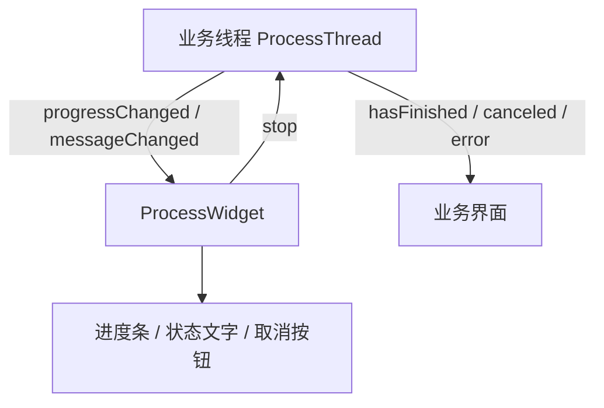

# 子线程与进度反馈设计

GUI 程序中的登录、网络请求、下载和解析任务通常会放入后台线程执行。线程通过 Qt 信号把状态传回主线程，界面通过槽函数更新进度、文字、结果和错误提示。

如果你想新增一个后台任务，可以先阅读 [新增一个后台线程](#新增一个后台线程)。该节给出最短接入模板；遇到 `ProcessThread`、`ProcessWidget`、`can_run` 等概念时，再回到前面的章节补充上下文。

## 设计目标

子线程层主要解决以下问题：

- 耗时任务运行在 `QThread` 中，保持界面响应。
- 线程通过信号报告进度、文字、错误和完成状态。
- 可取消任务通过 `can_run` 协作退出。
- `ProcessWidget` 统一展示进度条、状态文字和取消按钮。
- 业务数据通过线程子类自定义信号返回界面。

## 整体结构

普通后台任务主要由三个类协作完成：

| 类型 | 位置 | 职责 |
| --- | --- | --- |
| `ProcessThread` | `app/threads/ProcessWidget.py` | 所有普通后台任务的基类 |
| `ProcessWidget` | `app/threads/ProcessWidget.py` | 绑定线程并展示进度状态 |
| `ProcessDialog` | `app/threads/ProcessWidget.py` | 用对话框承载 `ProcessWidget` |



`ProcessThread` 提供通用生命周期信号。具体线程会在此基础上增加业务信号，例如 `ScoreThread.scores`、`ScheduleThread.schedule`、`AttendanceFlowThread.flowRecord`。

## ProcessThread 信号契约

`ProcessThread` 继承自 `QThread`，并定义了一组通用信号。线程子类在 `run()` 中发出这些信号，UI 层和 `ProcessWidget` 负责接收。

| 信号 | 参数 | 用途 |
| --- | --- | --- |
| `progressChanged` | `int` | 设置确定进度条百分比，通常为 `0` 到 `100` |
| `messageChanged` | `str` | 更新状态文字 |
| `canceled` | 无 | 表示任务取消或失败结束 |
| `hasFinished` | 无 | 表示任务成功完成 |
| `setIndeterminate` | `bool` | 切换确定/不确定进度条 |
| `error` | `str, str` | 向界面报告错误标题和错误内容 |
| `deadTime` | `float` | 设置取消后等待线程自然退出的最长时间 |

推荐的生命周期约定：

- 成功路径：先发出业务结果信号，再发出 `hasFinished`。
- 失败路径：先发出 `error(title, message)`，再发出 `canceled`。
- 主动取消：检测到 `can_run` 为 `False` 后释放资源并发出 `canceled`。

例如成绩线程成功时会先发出 `scores`，随后发出 `hasFinished`；网络错误时会发出 `error`，随后发出 `canceled`。

## can_run 与取消机制

`ProcessThread` 初始化时会设置 `self.can_run = True`。`ProcessWidget` 的取消按钮会发出 `stop` 信号，该信号连接到线程的 `onStopSignal()` 槽函数，最终把 `can_run` 改为 `False`。

可取消线程需要在关键步骤之间检查 `can_run`：

```python
if not self.can_run:
    self.canceled.emit()
    return
```

通常在以下位置检查：

- 登录或初始化完成后。
- 每次网络请求前后。
- 循环下载或批量处理的每一轮。
- 发出最终结果前。

取消机制是协作式的。线程需要主动检查 `can_run` 并结束 `run()`。当线程卡在长时间网络请求或阻塞操作中时，`ProcessWidget` 会在超时后执行强制终止。

## ProcessWidget 信号槽关系

`ProcessWidget` 负责把线程信号转换为可见的进度反馈。创建时，它会连接目标线程的通用信号。

| 线程信号 | Widget 槽函数 | 效果 |
| --- | --- | --- |
| `progressChanged` | `onSetProgress()` | 更新确定进度条 |
| `messageChanged` | `onSetMessage()` | 更新状态文字 |
| `hasFinished` | `onFinished()` | 隐藏组件并发出 `finished` |
| `canceled` | `onStopped()` | 隐藏组件并发出 `canceled` |
| `started` | `onThreadStart()` | 启动线程监控定时器 |
| `setIndeterminate` | `onSetIndeterminate()` | 切换进度条类型 |
| `deadTime` | `onSetDeadTime()` | 调整强制结束等待时间 |

`ProcessWidget` 自己也提供三个信号：

| Widget 信号 | 用途 |
| --- | --- |
| `stop` | 通知线程进入取消状态 |
| `canceled` | 通知业务界面任务已经取消 |
| `finished` | 通知业务界面任务成功完成 |

`ProcessWidget.canceled` 与线程的 `canceled` 含义相近，但触发来源包括用户取消和 Widget 强制终止线程后的结果通知。业务界面可以连接它来执行统一的清理逻辑。

## 进度条模式

`ProcessWidget` 内部包含两个进度条：

- `ProgressBar`：确定进度，显示百分比。
- `IndeterminateProgressBar`：不确定进度，显示持续运行状态。

线程通过 `setIndeterminate` 切换模式：

```python
self.setIndeterminate.emit(True)
self.messageChanged.emit(self.tr("正在登录教务系统..."))
```

常见使用方式：

| 场景 | 推荐模式 |
| --- | --- |
| 登录、等待服务器响应 | 不确定进度 |
| 多步骤查询 | 确定进度 |
| 文件下载且有 `Content-Length` | 确定进度 |
| 文件下载且大小未知 | 不确定进度 |

切换为确定进度后，应通过 `progressChanged.emit(value)` 更新进度。`value` 通常保持在 `0` 到 `100`。

## 取消按钮与强制终止

当 `ProcessWidget` 的 `stoppable=True` 时，组件会显示取消按钮。用户点击取消后，流程如下：

1. 取消按钮被禁用。
2. 状态文字更新为“子线程正在退出”。
3. Widget 发出 `stop`。
4. `ProcessThread.onStopSignal()` 将 `can_run` 设置为 `False`。
5. Widget 启动定时检查线程是否已经退出。
6. 超过 `thread_dead_time` 后调用 `terminate()` 并等待线程结束。
7. Widget 发出 `canceled`。

默认 `thread_dead_time` 为 5 秒。线程可以通过 `deadTime.emit(seconds)` 调整等待时间。下载、大文件处理或长请求任务可以适当延长这个时间。

确定进度条在取消等待阶段会显示倒退动画。`ProcessWidget(backward_animation=False)` 可以关闭该动画。

## 错误处理约定

线程的错误处理应统一转换为 `error` 和 `canceled` 信号。典型异常包括：

- 用户取消二维码登录。
- 用户取消 MFA 验证。
- MFA 或二维码 provider 不可用。
- `ServerError`。
- `requests.ConnectionError`。
- `requests.RequestException`。
- 其他异常。

常见模式如下：

```python
try:
    result = do_work()
except requests.ConnectionError:
    logger.error("网络错误", exc_info=True)
    self.error.emit(self.tr("无网络连接"), self.tr("请检查网络连接，然后重试。"))
    self.canceled.emit()
except requests.RequestException as e:
    logger.error("网络错误", exc_info=True)
    self.error.emit(self.tr("网络错误"), str(e))
    self.canceled.emit()
except Exception as e:
    logger.error("其他错误", exc_info=True)
    self.error.emit(self.tr("其他错误"), str(e))
    self.canceled.emit()
else:
    self.resultReady.emit(result)
    self.hasFinished.emit()
```

界面层通常把 `error` 连接到 InfoBar、MessageBox 或自定义错误处理槽函数。

## 业务结果信号

`ProcessThread` 只定义通用生命周期信号。业务数据由线程子类自定义信号传回 UI。

示例：

| 线程 | 业务信号 | 含义 |
| --- | --- | --- |
| `ScoreThread` | `scores` | 成绩列表与账号类型 |
| `ScheduleThread` | `schedule` / `exam` | 课表与考试安排 |
| `AttendanceFlowThread` | `flowRecord` | 考勤流水分页结果 |
| `AttendanceFlowThread` | `successMessage` | 成功提示文本 |

业务界面应连接业务信号来更新数据模型，再连接 `hasFinished` 或 `ProcessWidget.finished` 做收尾展示。

## ProcessWidget 使用方式

UI 层通常先创建线程，再创建对应的 `ProcessWidget`，然后连接业务信号和错误信号。

```python
self.thread_ = CustomThread()
self.processWidget = ProcessWidget(
    self.thread_,
    parent=self.view,
    stoppable=True,
    hide_on_end=True,
)
self.thread_.resultReady.connect(self.onResultReady)
self.thread_.error.connect(self.onThreadError)
self.processWidget.canceled.connect(self.onThreadCanceled)
self.thread_.start()
```

`ProcessWidget` 构造参数：

| 参数 | 含义 |
| --- | --- |
| `thread` | 需要绑定的 `ProcessThread` |
| `parent` | Qt 父对象 |
| `stoppable` | 是否显示取消按钮 |
| `hide_on_end` | 成功或取消后是否隐藏组件 |
| `backward_animation` | 取消等待时是否显示进度倒退动画 |

## 辅助监视线程

`ProcessWidget.connectMonitorThread()` 可以把辅助线程连接到同一个进度组件。辅助线程可以更新：

- `progressChanged`
- `messageChanged`
- `setIndeterminate`
- `deadTime`

辅助线程的成功或取消不会改变主任务生命周期。这个能力适合主线程执行核心任务、监视线程汇报附加状态的场景。

使用完成后应调用 `disconnectMonitorThread()` 断开辅助线程信号，避免后续状态误更新到旧组件。

## ProcessDialog

`ProcessDialog` 用对话框承载 `ProcessWidget`。它隐藏默认按钮组，并根据线程生命周期关闭对话框：

- 线程发出 `hasFinished` 或 Qt 自带 `finished` 时，调用 `accept()`。
- 线程发出 `canceled` 或 Widget 强制终止后，调用 `reject()`。

它适合临时操作、导入导出、更新下载等需要弹出进度对话框的流程。

## 新增一个后台线程

新增后台任务时，优先继承 `ProcessThread`。线程内部执行耗时逻辑，通过信号把状态和结果传回 UI。

```python
from __future__ import annotations

import requests
from PyQt5.QtCore import pyqtSignal

from app.threads.ProcessWidget import ProcessThread
from app.utils import logger


class CustomThread(ProcessThread):
    resultReady = pyqtSignal(dict)

    def run(self) -> None:
        self.can_run = True
        self.setIndeterminate.emit(True)
        self.messageChanged.emit(self.tr("正在准备..."))

        try:
            if not self.can_run:
                self.canceled.emit()
                return

            result = self.do_work()

            if not self.can_run:
                self.canceled.emit()
                return

        except requests.ConnectionError:
            logger.error("网络错误", exc_info=True)
            self.error.emit(self.tr("无网络连接"), self.tr("请检查网络连接，然后重试。"))
            self.canceled.emit()
        except Exception as e:
            logger.error("后台任务失败", exc_info=True)
            self.error.emit(self.tr("操作失败"), str(e))
            self.canceled.emit()
        else:
            self.resultReady.emit(result)
            self.hasFinished.emit()

    def do_work(self) -> dict:
        return {"ok": True}
```

如果线程需要登录校内系统，应通过当前账号的 `SessionManager` 获取站点 Session，并调用 `ensure_login()`。登录和网络请求阶段通常使用不确定进度，拿到可估算步骤后再切换为确定进度。

## 设计约定

- 耗时网络请求放入 `ProcessThread`。
- 线程内部通过信号更新 UI 状态。
- UI 对象更新放在主线程槽函数中。
- 成功结束发出业务结果信号和 `hasFinished`。
- 失败或取消结束发出 `canceled`。
- 错误信息通过 `error` 传递。
- 可取消线程在关键步骤检查 `can_run`。
- 业务数据使用子类自定义信号返回。
- `ProcessWidget` 负责进度展示和取消入口。

## 继续阅读

- [Session 管理设计](./session)：后台线程如何获取和复用校内系统登录态。
- [认证与登录系统](./auth)：统一认证、MFA、二维码、WebVPN 登录器。
- [文档站维护](./docs-site)：如何新增和维护文档站页面。
- [软件模块介绍](./introduction)：项目 API 层、GUI 层与文档层的总体结构。
