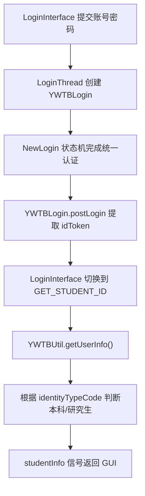

# 新师生服务大厅模块

`ywtb` 模块封装新师生综合服务大厅 `ywtb.xjtu.edu.cn` 相关接口。当前项目中，它最重要的用途是在添加账号流程中获取用户姓名、账号标识和身份类型。

与 `jwxt`、`gmis` 这类业务模块相比，`ywtb` 当前更接近登录辅助模块：它提供新师生服务大厅登录后的 token 提取能力，并用这个登录态查询用户基本信息。模块中也保留了通过教学周接口推算学期开始日期的能力。

## 模块职责

`ywtb` 模块当前支持：

- 登录新师生综合服务大厅。
- 从登录回调 URL 中解析 `ticket`。
- 从 `ticket` JWT 中提取 `idToken`。
- 写入访问服务大厅 API 所需的请求头。
- 查询当前用户基本信息。
- 根据教学周接口推算指定学期开始日期。

当前项目中没有独立的 `YWTBSession` 注册到 `SessionManager`，也没有单独的新师生服务大厅业务界面。`YWTBLogin` 主要由添加账号流程中的 `LoginThread` 临时使用。

## 代码位置

| 文件 | 职责 |
| --- | --- |
| `ywtb/util.py` | `YWTBLogin` 与 `YWTBUtil` |
| `ywtb/__init__.py` | 导出 `YWTBLogin` 和 `YWTBUtil` |
| `auth/constant.py` | `YWTB_LOGIN_URL` 登录入口 |
| `app/threads/LoginThreads.py` | 添加账号时使用 `YWTBLogin` 和 `YWTBUtil.getUserInfo()` |
| `app/sub_interfaces/LoginInterface.py` | 登录成功后触发用户信息查询 |

## 当前使用状态

添加账号时，GUI 会通过 `LoginThread` 使用新师生服务大厅完成以下工作：

1. 创建 `YWTBLogin`。
2. 使用 `NewLogin` 状态机完成统一认证。
3. 登录成功后执行 `YWTBLogin.postLogin()`，提取并保存 `x-id-token`。
4. `LoginInterface.__on_login_success()` 将线程状态切换到 `GET_STUDENT_ID`。
5. `LoginThread` 创建 `YWTBUtil(self.login.session)`。
6. 调用 `getUserInfo()` 获取用户信息。
7. 根据 `identityTypeCode` 转换本科生/研究生账号类型。
8. 通过 `studentInfo` 信号把信息返回 GUI。

这条链路让本地账号创建流程可以拿到账号类型和展示名称。

## YWTB_LOGIN_URL

登录入口定义在 `auth/constant.py`：

```python
YWTB_LOGIN_URL = "https://login.xjtu.edu.cn/cas/login?service=..."
```

这个地址是一个 CAS service URL。统一认证完成后，服务器会重定向回新师生服务大厅页面，并在最终 URL 中携带 `ticket` 参数。

`YWTBLogin` 继承 `NewLogin`，因此登录流程仍由统一认证状态机处理。验证码、MFA、多身份账户选择等分支都沿用 `NewLogin` 的实现。

## YWTBLogin 与 x-id-token

部分新师生服务大厅接口要求请求头携带：

- `x-device-info`
- `x-terminal-info`
- `x-id-token`

`YWTBLogin.postLogin()` 负责在统一认证成功后写入这些请求头。

处理流程：

1. 用 `urlparse()` 解析 `login_response.url`。
2. 用 `parse_qs()` 读取 query 中的 `ticket`。
3. 将 `ticket` 作为 JWT 解码。
4. 从 JWT payload 中读取 `idToken`。
5. 更新当前 session 的请求头。

核心代码如下：

```python
decoded = jwt.decode(
    x_token_id,
    "",
    algorithms="HS512",
    options={"verify_signature": False},
)

self.session.headers.update({
    "x-device-info": "PC",
    "x-terminal-info": "PC",
    "x-id-token": decoded["idToken"],
})
```

这里解码 JWT 的目的只是读取 payload 中的 `idToken`。JWT 的 header 和 payload 是可解码数据；签名校验需要服务端密钥，客户端在这里仅做字段提取。

如果回调 URL 中缺少 `ticket`，`postLogin()` 会抛出 `ServerError(500, "由于服务器问题，登录失败。")`。

## YWTBUtil

`YWTBUtil` 是新师生服务大厅 API 的轻量包装器。它持有一个已经登录并带有服务大厅请求头的 session。

| 方法 | 用途 |
| --- | --- |
| `getUserInfo()` | 获取当前用户基本信息 |
| `getStartOfTerm(timestamp)` | 推算指定学期开始日期 |

`YWTBUtil` 的对象适合在需要调用接口时临时创建。当前 session 变化后，应重新创建新的 `YWTBUtil`。

## 用户信息查询

`getUserInfo()` 请求当前用户基本信息接口：

```text
https://authx-service.xjtu.edu.cn/personal/api/v1/personal/me/user
```

请求中会附带 Referer：

```python
headers={"Referer": "https://ywtb.xjtu.edu.cn/main.html"}
```

返回数据中的关键字段包括：

| 字段 | 含义 |
| --- | --- |
| `username` | 用户名称 |
| `attributes.userUid` | 用户账号标识，通常对应学号 |
| `attributes.userName` | 用户名称 |
| `attributes.identityTypeCode` | 身份类型代码 |
| `attributes.identityTypeName` | 身份类型名称 |

`LoginThread` 会根据 `identityTypeCode` 判断账号类型：

| `identityTypeCode` | 账号类型 |
| --- | --- |
| `S01` | `NewLogin.AccountType.UNDERGRADUATE` |
| `S02` | `NewLogin.AccountType.POSTGRADUATE` |

遇到其他身份类型代码时，线程会抛出 `ServerError`，提示服务器返回了未知身份类型代码。

`LoginThread.studentInfo` 信号用于把查询结果返回 GUI。信号注释写的是“传输学号、账号类型、姓名”，当前实现发出的是 `result["username"]`、账号类型和 `result["attributes"]["userName"]`。维护这里时，应以服务端实际返回字段和账号创建逻辑共同确认字段含义。

## 添加账号调用链



`LoginThread._handle_login_status()` 会循环处理 `LoginState`。当状态为 `SUCCESS` 时，线程发出 `loginSuccess`；随后 `LoginInterface.__on_login_success()` 将线程任务切换为 `GET_STUDENT_ID`，继续查询用户信息。

## 学期开始日期推算

`getStartOfTerm(timestamp)` 用于推算指定学期开始日期。`timestamp` 是形如 `2024-2025-1` 的学年学期代码。

实现思路：

1. 拆分学年开始年份、结束年份和学期尾号。
2. 尾号为 `1` 时，按秋季学期处理，枚举 8 月和 9 月的一组候选日期。
3. 尾号为 `2` 时，按春季学期处理，枚举 2 月和 3 月的一组候选日期。
4. 请求新师生服务大厅教学周接口。
5. 找到目标学年、目标学期且教学周为 `1` 的候选日期。
6. 用 `datetime` 计算该日期所在周的周一。
7. 返回 `"YYYY-MM-DD"` 字符串。

教学周接口地址：

```text
https://ywtb.xjtu.edu.cn/portal-api/v1/calendar/share/schedule/getWeekOfTeaching
```

请求参数中，`today` 是逗号拼接的候选日期列表，`random_number` 是随机三位数。

接口返回数据中的三个数组会被按下标合并：

| 返回字段 | 含义 |
| --- | --- |
| `date` | 教学周编号 |
| `semesterAlilist` | 学期名称，例如 `第一学期` / `第二学期` |
| `semesterlist` | 学年编号，例如 `2024-2025` |

如果传入的学期尾号为 `1` 或 `2` 以外的值，方法会抛出 `ValueError`。如果候选日期中找不到第一教学周，方法会抛出 `ServerError(500, "无法确定学期开始时间")`。

当前本科课表使用 `jwxt.Schedule.getStartOfTerm()` 获取学期开始日期。研究生课表的批量学期开始日期映射位于 `gmis.Schedule.getStartOfTermMap()`。`YWTBUtil.getStartOfTerm()` 是基于新师生服务大厅教学周接口保留的辅助能力。

## 典型调用示例

真实 GUI 中，登录状态机处理逻辑位于 `LoginThread._handle_login_status()`。下面示例只展示 `YWTBLogin` 与 `YWTBUtil` 的关系：

```python
from ywtb import YWTBLogin
from ywtb.util import YWTBUtil

login = YWTBLogin(visitor_id=str(cfg.loginId.value))
state, info = login.login(username, password)

# 调用方处理 MFA、验证码、多身份选择等 LoginState 分支。
# 状态机成功后，YWTBLogin.postLogin() 已写入服务大厅请求头。

util = YWTBUtil(login.session)
user_info = util.getUserInfo()
```

## 与其他模块的关系

| 模块 | 关系 |
| --- | --- |
| `auth` | `YWTBLogin` 继承 `NewLogin`，复用统一认证状态机 |
| `LoginThread` | 使用 `YWTBLogin` 登录，并用 `YWTBUtil.getUserInfo()` 获取账号信息 |
| `LoginInterface` | 登录成功后触发 `GET_STUDENT_ID` 阶段 |
| `session` 机制 | 当前没有 `YWTBSession` 接入 `SessionManager` |
| `jwxt` | 本科课表当前使用 `jwxt.Schedule.getStartOfTerm()` |
| `gmis` | 研究生课表使用 `gmis.Schedule.getStartOfTermMap()` 获取学期开始日期映射 |

如果未来要在 GUI 多处长期复用新师生服务大厅登录态，可以考虑增加 `YWTBSession`，并参考 `CommonLoginSession` 接入 `SessionManager`。

## 维护注意事项

- `postLogin()` 依赖回调 URL 中存在 `ticket` 参数。
- `ticket` 的 JWT payload 中需要包含 `idToken`。
- `getUserInfo()` 依赖 `x-id-token`、`x-device-info` 和 `x-terminal-info` 请求头。
- `identityTypeCode` 当前只映射 `S01` 和 `S02`。
- `getStartOfTerm()` 依赖教学周接口返回的 `date`、`semesterAlilist` 和 `semesterlist` 三个数组顺序一致。
- 服务大厅接口结构变化时，优先检查 `YWTBLogin.postLogin()` 和 `YWTBUtil` 中的字段读取逻辑。

## 继续阅读

- [认证与登录系统](./auth)：`NewLogin` 状态机与 `postLogin()` 扩展点。
- [Session 管理设计](./session)：如果未来新增 `YWTBSession`，可以参考这里。
- [子线程与进度反馈设计](./thread)：登录线程和业务线程如何通过信号返回 GUI。
- [本科教务系统模块](./jwxt)：本科课表中当前使用的学期开始日期查询。
- [研究生管理信息系统模块](./gmis)：研究生课表与电子校历接口。
