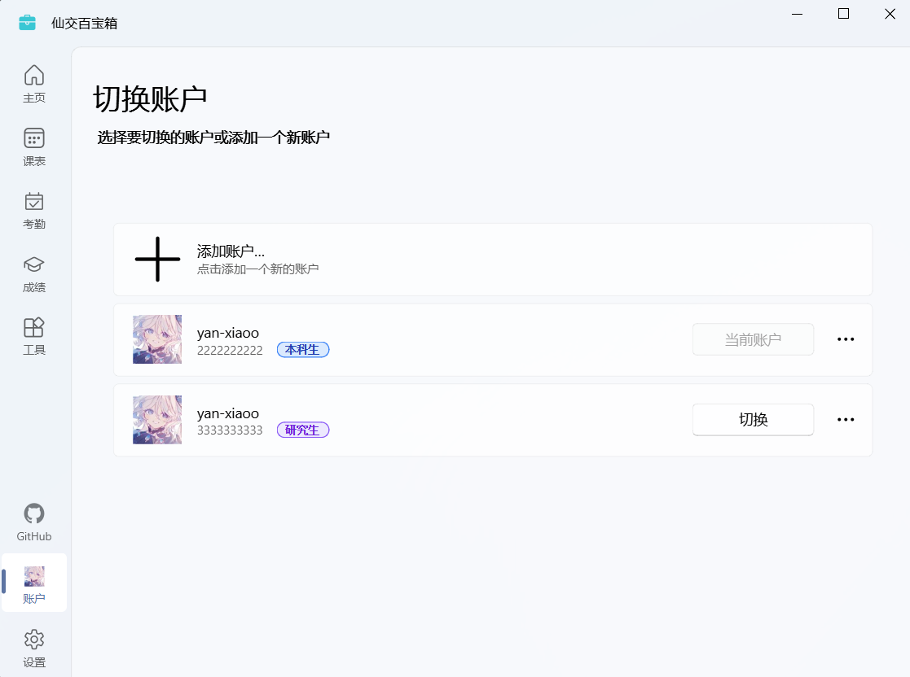

# 登录与账户管理

在这里，你可以添加多个账户，在账户之间任意切换，查询不同账户的信息。

## 功能概览

课表与考勤界面为你提供了登录、多账户支持与个性化功能，主要功能包括：

1. **登录**：可以使用学号与密码登录账户，且可以通过学校登录认证系统要求的两步验证。
2. **多账户支持**：可以添加多个账户，并在它们之间切换，方便管理不同身份的信息。
3. **个性化设置**：每个账户都可以设置不同的昵称和头像。

## 登录

你需要输入账号信息（学号或注册手机号）与密码来登录账户。大部分情况下，在第一次登录时，需要进行两步验证。你需要通过账号绑定的手机号接收一条验证码短信，输入验证码后才能完成登录。

::: details 为什么需要密码？

:::