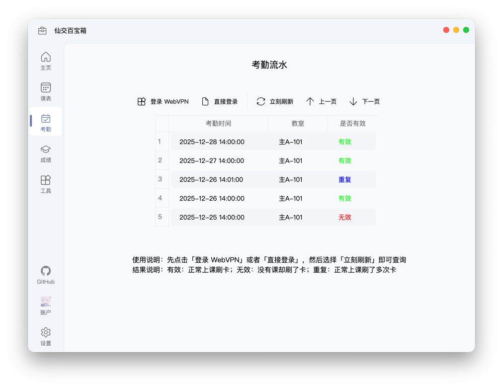

# 考勤流水

在这里，你可以快速查询并浏览所有的考勤打卡记录。

::: tip 这个功能和“课表”中的考勤查询有什么区别？
“课表”界面中的考勤查询，是用于查看**每节课最终的考勤状态**（如正常、迟到、缺勤等）。

而本页面则直接同步并展示了你在考勤机上的**每一次刷卡操作**，即“考勤流水”，其中甚至包括了刷卡失败的无效记录。

未来，我们计划在此基础上增加考勤统计功能，帮助你快速回顾一学期内所有课程的出勤率与详细情况。
:::

## 登录考勤系统

由于学校的考勤系统限制校内网络访问，如果你不在校园网环境下，需要通过 WebVPN 才能连接。

- **校外网络环境**：请点击操作栏中的 `WebVPN 登录` 按钮。
- **校园网环境**：请点击 `直接登录` 按钮以进入系统。

::: tip 哪些网络是校园网？
通常，以下网络环境属于校园网：

- 学生宿舍区的 `STU` 无线网络
- 教学区的 `XJTU_STU` 和 `xjtu_lib` 无线网络
- 在宿舍办理的宽带套餐（通过路由器连接也算）

而这些则属于校外网络：

- 手机流量
- 手机开启的个人热点
- 校外的任何网络

简单来说：**不在校园网，就必须用 WebVPN**。
:::

## 查询考勤流水

成功登录考勤系统后，点击 `立刻刷新` 按钮，即可获取最新的考勤流水。你可以查看每条记录的课程名称、打卡时间、打卡状态等详细信息。

通过操作栏上的 `上一页` / `下一页` 按钮，你可以翻页浏览更早的考勤记录。

### 考勤流水状态说明

你在打卡机上每一次刷卡，无论当时当地是否有课，都会产生一条考勤流水。这些流水有以下三种状态：

| 考勤流水状态 | 含义 | 可能情况 |
| :---: | :---: | :--- |
| 有效 | 本次刷卡成功 | 在正确的上课时间与地点刷卡 |
| 重复 | 课程已有打卡记录 | 本次刷卡成功，但之前已在该教室刷过卡 |
| 无效 | 刷卡失败 | 在没有课程的教室刷卡，或不在有效打卡时段内 |  
