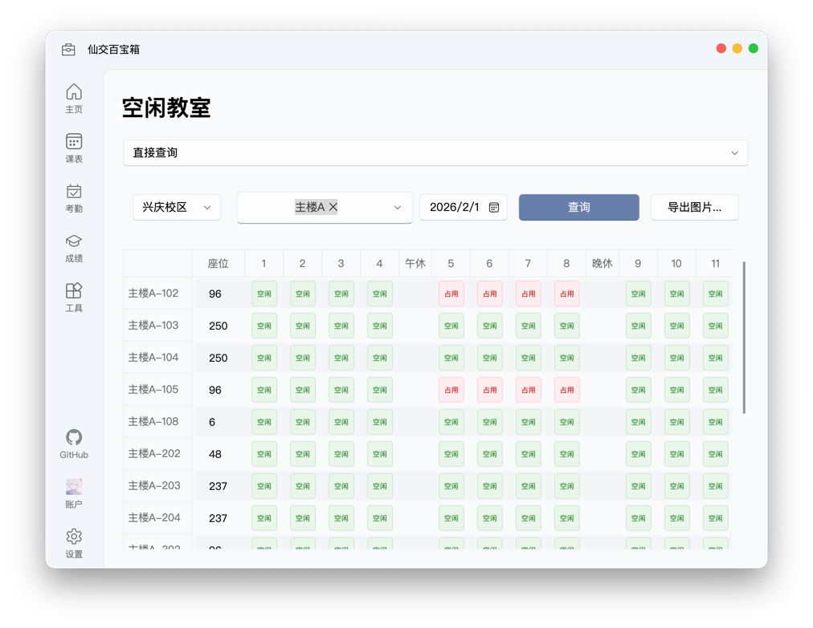

# 空闲教室

在这里，你可以轻松查询学校各个校区的空闲教室，并一键将结果导出为图片，方便随时离线查看。

## 查询空闲教室

你可以选择单个或多个教学楼，查询它们在指定日期的空闲教室安排。

### 直接查询 vs. CDN 查询

我们提供两种查询方式，以适应不同场景的需求：

- **直接查询**：使用你已登录的本科生账户，实时从学校教务系统获取最新的空闲教室数据。由于需要逐个教学楼查询，速度可能稍慢。
- **Cloudflare CDN 查询**：通过我们预先上传到数据分发网络（CDN）的数据进行查询。这种方式无需登录，且速度更快。

> 2026 年 5 月后，由于学校服务器对校外访问的严重限制，我们无法更新 CDN 数据，因此请你采用“直接查询”来获取最新的空闲教室信息。

### 导出空闲教室信息

点击界面右侧的“导出图片”按钮，即可将当前的查询结果保存为一张清晰的图片。

为了保证最佳的可读性，即使你正在使用深色主题，导出的图片背景也始终会是白色。