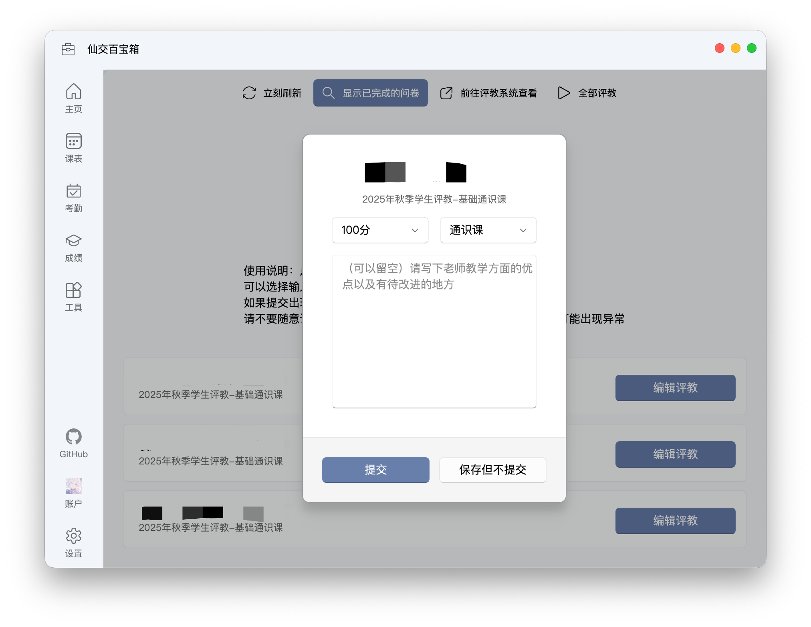

# 一键评教

在这里，你可以一键完成本学期的所有教学评价问卷，并自由选择是否提交评语。

## 获取评教问卷

点击页面左上角的“立刻刷新”按钮，或页面中央的“获取评教问卷”按钮，即可自动获取本学期的所有评教问卷。

::: tip 研究生评教登录
研究生的评教系统限制只能使用校内网络访问。因此，在获取评教问卷时，程序会询问你是否需要通过 WebVPN 连接。请根据你当前的网络环境选择：
- **校外网络环境**：请选择“是”，程序将通过 WebVPN 连接并获取问卷。
- **校园网环境**：请选择“否”，程序将直接连接并获取问卷。
:::

## 完成评教

你可以逐一为课程提交评价，也可以点击页面右上角的 `一键评教` 按钮，一次性完成所有课程的评价。

### 评教单个课程

点击课程右侧的 `开始评教` 按钮，即可进入该课程的评教界面。在这里，你可以设定一个统一的“评教分数”，并（可选地）撰写一段评语作为所有主观题的答案。

点击 `提交` 按钮，程序会自动将你的设置提交至学校评教系统。若点击 `保存但不提交`，你的设置将仅保存在本地。

::: details 如果评教失败了，我可以试着做什么？
如果你在提交评教时遇到错误，可以尝试以下方法解决：

1. 如果你是本科生

本科生的评教问卷只按课程类型（如通识课、理论课、体育课等）区分，同类型课程的问卷模板是相同的。

程序会自动识别并选择课程类型，但如果分类错误，提交时便会失败。你可以在评教界面手动修改课程右侧的“课程类型”下拉框，选择正确的类型后重试。

此外，程序目前仅支持自动填写选择题、评分题和主观题（评语）。你可以前往教务系统官网，检查该课程的问卷是否包含其他特殊题型。

如果遇到这种情况，欢迎在 GitHub 上[提交 Issue](https://github.com/yan-xiaoo/XJTUToolBox/issues/new?template=bug_report.yml)，我们会尽快适配新的题型。

2. 如果你是研究生

研究生的评教问卷通常是各不相同的。程序会直接从网页抓取并展示问卷中的所有题目。

因此，提交失败很可能是因为该问卷包含了程序尚未支持的新题型。

我们很难提供一个通用解决方案。请在 GitHub 上[提交 Issue](https://github.com/yan-xiaoo/XJTUToolBox/issues/new?template=bug_report.yml)，并附上该课程在评教网站中问卷的截图（请隐去个人信息），以便我们尽快定位并解决问题。
:::

### 一键评教

如果你不想逐一操作，可以直接点击页面右上角的 `一键评教` 按钮，一次性完成所有未评价的课程。

在弹出的窗口中，你需要设定一个统一的“评教分数”，并（可选地）撰写一段评语。点击 `提交` 后，程序会将这些设置应用到所有未评价的课程问卷中并提交。

::: tip
如果你不填写评语，所有问卷的主观题（评语）部分将自动填充为“无”，而不会留空。
:::

### 评教分数的含义是什么？

你所填写的“评教分数”是一个 0-100 的数值，程序会根据不同题型将其自动换算为对应的选项。具体规则如下：

- **选择题**：程序会按比例映射到选项上。例如，对于“完全符合”到“很不符合”的五个选项，100 分对应“完全符合”，80 分对应“比较符合”，以此类推。
- **评分题**：程序会按比例计算得分。例如，对于一个 20 分制的题目，100 分对应 20 分，80 分对应 16 分；对于一个 30 分制的题目，100 分对应 30 分，80 分对应 24 分，以此类推。

你可以随时点击评教界面上方的 `前往评教系统查看` 按钮，跳转至官网核对程序提交的结果，确保所有选项均已按预期正确填写。
