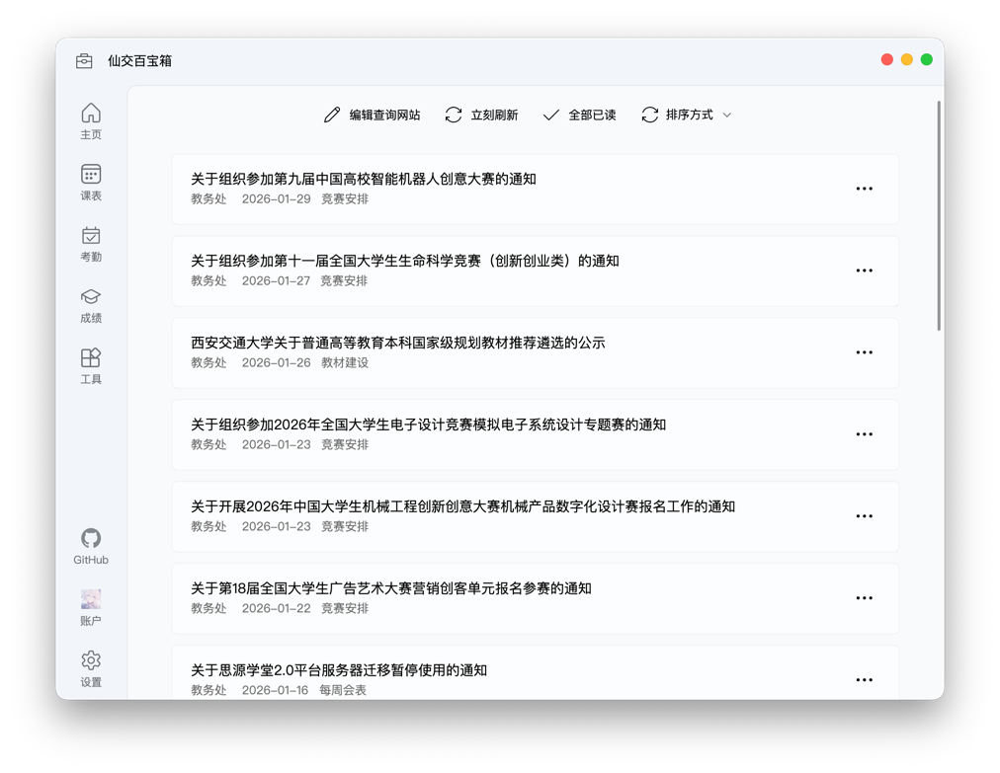

# 通知查询

在这里，你可以聚合来自多个官方网站的通知，并通过设定过滤规则，只看你关心的内容。

## 订阅通知来源

目前支持订阅教务处、软件学院、研究生院三个官方网站的通知。

点击左上角的“编辑查询网站”或页面中央的“添加通知配置”，即可轻松管理你的通知来源。添加后，点击主界面上方的“立刻刷新”按钮，随时获取最新通知。

获取通知无需登录，你的任何账户信息都不会被发送。

## 通知排序

获取通知后，你可以使用右上方的“排序方式”按钮来调整通知的展示顺序，主要支持两种模式：

- **按来源排序**：将同一网站的通知聚合在一起，并按照你设置的订阅源顺序排列。
- **按时间排序**：将所有通知统一按发布时间排序，可选择最新或最旧的在前。

如果同时启用“按来源排序”和“按时间排序”，通知会先按来源分组，然后在每个来源内按时间排序。

## 通知筛选

你可以为每个通知来源设置独立的筛选规则，只接收你感兴趣的通知。点击左上角的 `编辑订阅源`，在每个订阅源的设置卡片中找到并点击 `设置过滤规则`，即可开始创建。

你可以添加多条**规则**，规则之间是“或”的关系，即满足任意一条规则的通知都会被显示。

每条规则内部可以包含多个**条件**，条件之间是“且”的关系，即通知必须满足该规则下的所有条件才会被匹配。

每个条件都可以设置为：

- **标题** 包含 / 不包含 某些关键词
- **标签** 包含 / 不包含 某些关键词

::: tip 通知的“标签”是什么？
“标签”是教务处、研究生院等官网通知中的一种分类信息，通常是简短的词语。

在程序中，标签会显示在通知日期的右侧（如“竞赛安排”、“教材建设”）；在官网上，标签则通常以彩色字的形式出现在标题前方。

通知标签由发布单位设定，没有完全固定的规律。
:::

通过组合使用这些规则，你可以轻松构建出强大的筛选逻辑。例如，你想从教务处网站上只关注“补考”和“选课”相关的通知：

1.  首先，通过官网历史通知了解到，这类信息通常带有“课程安排”标签。
2.  在程序中，为“教务处”这个订阅源添加第一条**规则**，并为该规则添加两个**条件**：
    *   条件一：“标签”包含“课程安排”
    *   条件二：“标题”包含“补考”
3.  接着，添加第二条**规则**，同样包含两个**条件**：
    *   条件一：“标签”包含“课程安排”
    *   条件二：“标题”包含“选课”

这样设置后，程序就只会为你显示来自教务处、标签为“课程安排”、且标题包含“补考”或“选课”的通知了。

## 自动查询通知

你可以在设置界面中，配置程序在每天的固定时间自动查询通知。具体操作请参考 [定时任务](scheduled-event.md) 章节的文档。