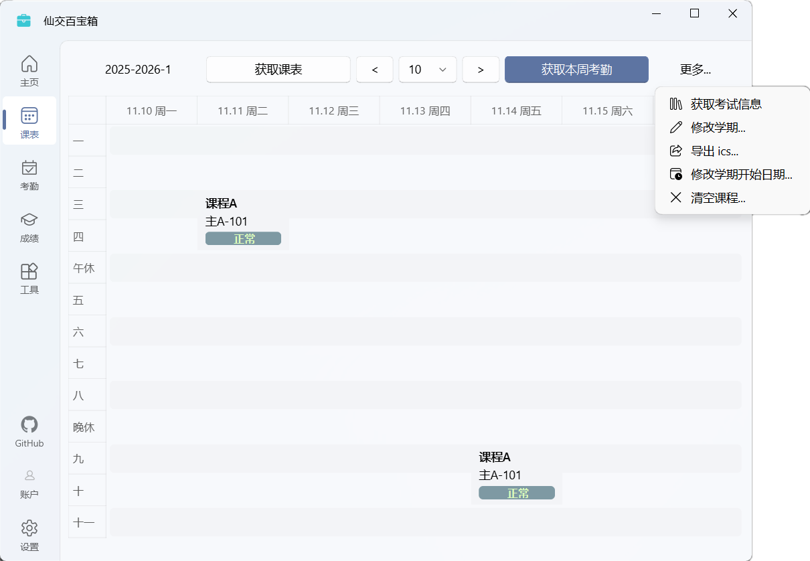

# 课表与考勤

在这里，你可以集中查看所有课程、考试安排，并实时掌握每节课的考勤状态。

## 功能概览

课表与考勤界面为你提供了一站式的学习管理体验，主要功能包括：

- **课表查询**：支持查询任意学期的课程表。
- **考勤追踪**：直接在课表中显示每节课的考勤状态，让你对自己的出勤情况了如指掌。
- **考试安排**：自动同步考试时间与地点，与课程一同展示，避免错过重要考试。
- **个性化编辑**：支持添加自定义课程，或修改、删除已有课程信息（如上课地点、教师等）。
- **日历导出**：一键导出 `.ics` 日历文件，轻松同步至 Google Calendar、Outlook、Apple Calendar 等主流日历应用。

## 课表查询

在使用前，请确保你已登录西安交通大学账户。

首次使用时，请点击“获取课表”来同步当前学期的数据。这是后续查询考勤信息的基础。

- **切换学期**：点击左上角的学期按钮，或通过“更多”菜单中的“修改学期”选项，即可查看其他学期的课表。
- **编辑课程**：点击任意课程卡片，即可修改课程的地点、教师、名称等信息，也可以直接删除。

## 考勤查询

获取课表后，点击“获取本周考勤”就能刷新本周的考勤状态。各个状态的含义如下：

| 考勤状态 | 含义 | 可能情况 | 技术解释 |
| :---: | :---: | :--- | :--- |
| 未知 | 没有获得课程相关的数据 | 尚未查询考勤 / 当天调课或放假 | 没有任何考勤流水和考勤统计信息 |
| 已打卡 | 课程已经有打卡流水 | 已打卡成功，但查询时尚未开始上课 | 查询到考勤流水记录、但不存在考勤统计信息 |
| 正常 | 课程打卡状态正常 | 课程打卡成功，没有任何问题 | 查询到“正常”统计信息 |
| 缺勤 | 课程没有打卡 | 旷课了，完全没有打卡 | 查询到“缺勤”统计信息 |
| 请假 | 课程请假了 | 教师已设置该课程为请假状态 | 查询到“请假”统计信息 |
| 迟到 | 课程中迟到了 | 课程开始 5 分钟后才打卡 | 查询到“迟到”统计信息 |
| 早退 | 课程中早退了 | 极少出现，考勤系统无法记录早退，可能是教师手动设置 | 查询到“早退”统计信息 |
| 无需考勤 | 课程是自定义课程 | 该课程为你手动添加，无法查询考勤 | 由于匹配问题，无法为自定义课程获得考勤信息 |

::: tip “未知”状态代表我缺勤了吗？
**不是的**。“未知”状态仅表示应用没有获取到该课程的任何考勤数据，但这**不代表**你缺勤了。

通常，“未知”状态由以下几种情况导致：

- 你还没有查询过考勤。
- 课程被调走或当天放假，没有实际的考勤记录。
- 学校考勤系统暂时无法访问或返回了异常数据。

你可以随时前往考勤系统核实，确认课程的实际状态（顺便看看是不是系统又出问题了）。
:::

### 课程有效打卡时间

学校的考勤系统对课程打卡时间有固定的规则：

1. **第 1-2 节、5-6 节、第 9 节**：有效打卡时间为 **课前 40 分钟 ~ 上课后 5 分钟**。上课 5 分钟后打卡会被记为迟到。

2. **第 3-4 节、7-8 节、10-11 节**：有效打卡时间为 **课前 35 分钟 ~ 上课后 5 分钟**。

例如：

- 早八（08:00）课程的有效打卡时间为 `07:20` 到 `08:05`。
- 早十（10:10）课程的有效打卡时间为 `09:35` 到 `10:15`。

### WebVPN 登录

本科生和研究生的考勤系统都限制了校内网络访问。如果你不在校园网环境下，需要通过 WebVPN 才能连接。

操作非常简单，在点击“获取本周考勤”时，在弹出的对话框中选择“WebVPN 登录”即可。

::: tip 如何默认使用 WebVPN 登录？
如果你经常在校外使用，可以在 `设置` > `考勤` > `考勤系统默认连接方式` 中，选择 `WebVPN 连接`。这样，后续查询考勤时将自动通过 WebVPN 连接，不再弹出选择框。
:::

### 哪些网络是校园网？

通常，以下网络环境属于校园网：

- 学生宿舍区的 `STU` 无线网络
- 教学区的 `XJTU_STU` 和 `xjtu_lib` 无线网络
- 在宿舍办理的宽带套餐（通过路由器连接也算）

而这些则属于校外网络：

- 手机流量
- 手机开启的个人热点
- 校外的任何网络

::: tip 什么时候需要用 WebVPN？
简单来说：**不在校园网，就必须用 WebVPN**。
如果你身处校园网环境，可以直接连接，当然也可以选择使用 WebVPN。
:::

## 自定义课程

你可以点击课表中的任意空白位置来添加自定义事件，例如课程、实验或自习安排。你可以自由设定它的上课周、名称、教师和地点等信息。

自定义课程仅用于个人记录和提醒，不会影响你真实的课表数据。

由于技术限制，所有自定义课程都无法查询考勤，其状态将始终显示为 `无需考勤`。

::: details 课表冲突了怎么办？
别担心，我们会保护你添加的自定义课程。

当你重新从学校服务器获取课表时，自定义课程不会被清除。如果自定义的课程与新获取的课程在时间上发生冲突，程序会弹出一个对话框，让你手动选择保留哪一个。
:::

## 获取考试信息

::: warning 功能限制
由于学校接口的原因，目前只有**本科生**账户支持此功能。
:::

点击 `更多` > `获取考试信息`，可以查询当前学期的考试安排。每次同步课表时，程序也会自动为你查询一次考试。

考试信息会直接显示在课表中，包括考试时间、教室和座位号。你也可以手动修改这些信息。

## 导出为日历文件

点击 `更多` > `导出 ics`，可以将当前学期的课表导出为 `.ics` 格式的日历文件。你可以轻松地将它导入到 Google 日历、Outlook、Apple 日历或小米日历等各类日历应用中。

导出时，你可以按需选择：

### 忽略节假日课程

学校返回的课表数据有时会包含法定节假日期间的课程，而这些课程实际上并不会上。勾选此项后，导出的日历将自动为你过滤掉这些无效课程。

### 设置提醒事项

勾选此项后，日历会为你的每个事件添加提醒。

- **课程**：开始前 15 分钟提醒
- **考试**：开始前 30 分钟提醒

## 切换学期

你可以查询并保存多个学期的课表与考勤信息，它们之间互不影响。

点击左上角的学期名称，或者选择 `更多` > `修改学期`，即可轻松切换。

- **本科生**：可查询秋季、春季和夏季小学期的课程。
- **研究生**：可查询秋季和春季学期的课程。

## 修改学期开始日期

::: warning 兼容性设置
此功能主要为解决研究生账户无法自动获取较早学期开始日期的问题。

对于本科生，如果你的课表时间显示正常，请**不要**随意修改，错误的设置可能导致考勤查询异常。
:::

如果你发现课表日期与实际不符，很可能是学期开始日期有误。你可以在 `更多` > `修改学期开始日期` 中手动修正。请将该日期设置为你所在学期第一教学周的周一。

修改后，程序会自动刷新整个课表。

## 兼容性说明

我们一直尽最大努力让本科生与研究生同学在使用本程序时的体验保持一致。但由于学校接口等限制，目前研究生账户在课表功能中，有以下几点差异：

1. **无法查询考试时间**
2. 对于超过一年的历史学期，**无法自动获取学期开始日期**，需要手动设置
3. **无法查询小学期**（暑假学期）的课程