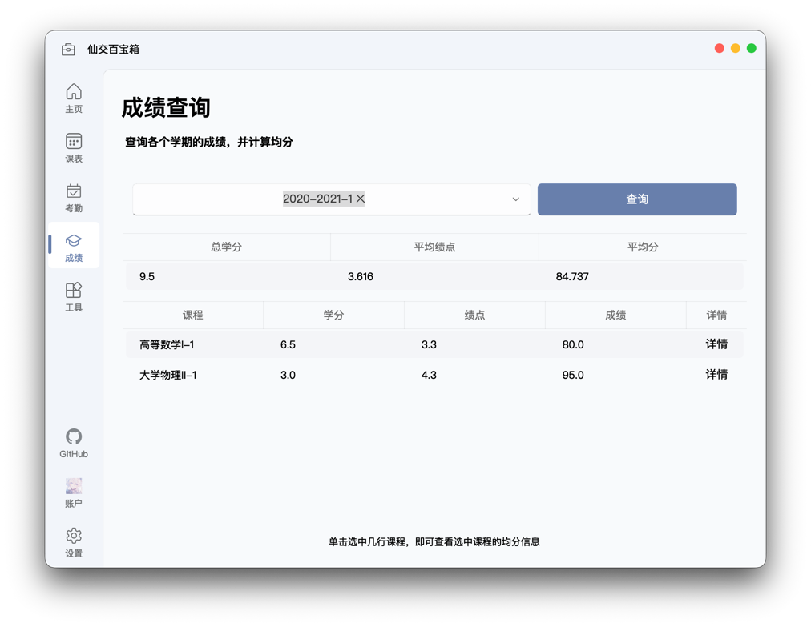

# 成绩查询与绩点计算

在这里，你可以查询一个或多个学期的成绩，并自由选择课程来计算均分和绩点，从而更好地评估自己的学业表现。

## 功能概览

成绩查询界面为你提供了便捷的成绩管理体验，主要功能包括：

- **多学期成绩查询**：支持同时查询一个或多个学期的成绩。
- **成绩详情查看**：点击任意课程，即可深入了解其成绩构成与各项得分。
- **灵活的均分计算**：自由选择课程，实时计算加权平均分与绩点。

## 成绩查询

在使用前，请确保你已登录西安交通大学账户。

你可以从下拉框中选择一个或多个学期，然后点击“查询”按钮来获取成绩。查询完成后，所选学期的全部课程将显示在下方表格中。点击表格最右侧的“详情”按钮，即可查看该课程的成绩构成和各部分得分。

## 均分计算

查询成绩后，你可以选择任意课程来计算它们的均分和绩点。

默认情况下，成绩表格上方的统计区域会计算已查询出的所有课程。如果你只想计算部分课程，可以按以下步骤操作：

1.  在成绩表格中，点击你想要计算的课程行来选中它们。再次点击已选中的行则会取消选择。
2.  此时，上方的统计区域将自动更新，仅显示你所选课程的均分和绩点。

### 均分计算方法

::: warning
本程序提供的均分与绩点计算方法，是基于对“西交小明”等常用工具及部分书院奖学金排名规则的分析总结，其结果仅供参考。

各学院、专业的官方计算规则可能存在差异。如有疑问，请务必以你所在学院的官方规定为准，或咨询教务处及辅导员。
:::

均分和绩点的计算均采用学分加权平均的方式，公式如下：

$$
均分 = \frac{\sum (课程分数 \times 课程学分)}{\sum 课程学分}
$$

$$
绩点 = \frac{\sum (课程绩点 \times 课程学分)}{\sum 课程学分}
$$

通常，在评定奖学金时，书院会将一年内的所有课程（包括通识课）都纳入计算范围。而在计算保研成绩时，学院则大多会剔除通识课，只保留培养方案内的课程。具体规则请以你所在学院或书院的规定为准。

## 成绩查询相关设置

你可以在 `设置` > `成绩查询` 中找到并调整以下高级选项：

### 忽略缓考课程

在教务系统中，缓考课程会在原学期留下一条成绩为 0 分的记录。虽然这不会影响你考试后的最终成绩，但会拉低该学期的均分和绩点。

开启此选项后，程序将自动过滤这些 0 分的缓考记录，确保均分计算的准确性。

### 未评教时查询成绩

如果你忘记完成当前学期的教学评价，将无法直接查询该学期的成绩。

开启此选项后，程序将尝试通过分析你的个人成绩单来绕过评教限制，从而获取成绩数据。请注意，该方法可能会增加查询耗时，建议仅在确实无法完成评教时使用。

::: details 为什么均分计算结果显示“不准确”？
当你在未完成评教的情况下使用“绕过评教”功能查询成绩时，如果该学期包含实验类课程，均分计算结果可能会显示为“不准确”。

这是因为，实验课在成绩单中通常只记录一个等级（如“A+”、“A”），而没有具体分数。然而，学校大部分均分/绩点计算规则都需要使用准确的百分制分数。

由于缺少准确分数，程序在计算时只能暂时忽略这些实验课，这可能导致最终的均分和绩点结果与实际情况存在偏差。
:::

## 兼容性说明

我们一直尽最大努力让本科生与研究生同学在使用本程序时的体验保持一致。但由于学校接口等限制，目前研究生账户在成绩相关功能中，有以下几点差异：

1.  只能查询全部学期的课程，无法选择部分学期。
2.  无法查询课程的成绩构成和每部分的得分。
3.  无法使用“绕过评教获取课程”功能。