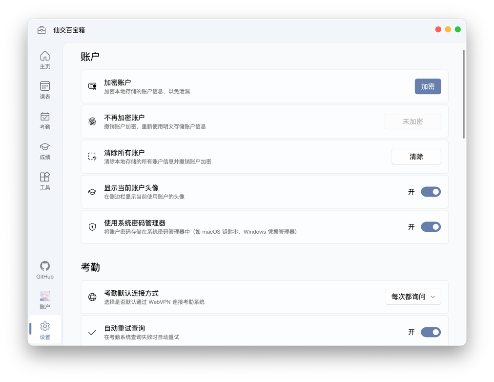

# 设置

在这里，你可以调整多个功能的设置，自定义你的体验。

设置界面主要包含以下几个部分：

- **账户与安全**：管理你的账户信息、头像以及加密选项。
- **考勤**：调整与考勤查询相关的功能。
- **成绩**：配置成绩查询的高级选项。
- **定时查询**：设置自动查询与消息推送。
- **个性化**：自定义应用的外观、主题与颜色。
- **关于**：查看应用信息、日志、检查更新等。

## 账户与安全

本节的设置主要与你的账户信息安全相关。

### 使用系统密码管理器

默认情况下，我们会使用你操作系统自带的密码管理器（如 Windows 的“凭据管理器”或 macOS 的“钥匙串”）来安全地存储你的账户信息。这与 Chrome、Edge 等主流浏览器的密码存储方式类似，能有效提升账户的安全性。

如果你关闭此选项，账户信息将以普通文件形式存储在本地。你可以前往 [常见问题](faq.md#_1-我的个人数据存储在哪里) 了解具体的存储位置。

### 账户加密

为了进一步增强安全性，你可以为存储的账户信息设置一个加密密码。

::: details 为什么要开启账户加密？
虽然系统密码管理器已经提供了一层保护，但在某些情况下（例如在 Windows 上），同一系统账户下的其他程序仍可能访问到这些数据。

开启账户加密后，我们会使用 AES 对称加密算法，将你的账户信息变为一串无法直接读取的密文。这样，即使有人访问了你的设备，也无法轻易获取你的真实账户信息。
:::

- **如何设置**：前往 `设置` > `账户` > `加密账户`，输入你的加密密码即可。
- **使用**：加密后，每次启动应用时，都需要输入该密码才能解锁并使用你的账户。
- **修改与取消**：你可以随时在同一位置修改密码，或选择 `不再加密账户` 来移除密码保护。

::: warning 忘记密码了怎么办？
如果你忘记了加密密码，将无法解密和使用已存储的账户。唯一的解决方法是点击 `清除所有账户`，这会删除所有本地账户数据并移除加密。
:::

### 在侧边栏显示账户头像

开启 `账户` > `显示当前账户头像` 后，我们会将你设置的头像显示在侧边栏的“账户”按钮上，让你能更直观地识别当前账户。

::: tip 如何设置头像？
在“账户”界面，点击已添加账户右侧的 `...` 按钮，选择 `修改头像`，即可选择你喜欢的图片作为头像。

请放心，你的头像和昵称只会保存在本地，仅用于应用内显示，不会上传到任何服务器。
:::

## 考勤

在这里，你可以调整与考勤查询相关的功能。

### 考勤默认连接方式

由于学校的考勤系统限制校内网络访问，在校外时需要通过 WebVPN 才能连接。为了方便你使用，我们提供了默认连接方式的设置。

在 `考勤` > `考勤默认连接方式` 中，你可以选择“直接连接”或“WebVPN 连接”。设置后，我们将默认使用你选择的方式访问考勤系统，无需每次手动选择。

### 自动重试查询

开启此选项后，如果在获取考勤数据时遇到网络问题导致查询失败，我们会自动为你重试，直到成功获取数据为止。

> 为避免给服务器带来不必要的压力，此功能仅在登录成功后、获取数据失败时触发，登录失败不会自动重试。

## 成绩

在这里，你可以配置成绩查询的高级选项。

### 忽略缓考课程

在教务系统中，缓考的课程会暂时记为 0 分，这会影响到你当前学期的绩点和均分计算。

开启此选项后，我们在计算时会自动过滤掉这些缓考记录，确保你看到的均分和绩点是准确的。

### 未评教时查询成绩

如果你忘记了完成学期末的教学评价，将无法直接查询该学期的成绩。

开启此选项后，我们会尝试通过解析你的完整成绩单来获取当学期的成绩。虽然这种方式不如正常查询稳定，但通常能帮助你在未评教的情况下提前看到成绩。

## 定时查询

在这里，你可以设置定时查询通知和成绩，并接收推送通知。

详情请参考 [定时查询](scheduled-event.md) 页面的说明。

## 个性化

在这里，你可以自定义应用的外观、主题与颜色。

### 应用主题

你可以在 `个性化` > `应用主题` 中选择喜欢的主题模式：

- **自动**：跟随你的操作系统自动切换浅色或深色模式。
- **浅色**：始终使用浅色主题。
- **深色**：始终使用深色主题。

### 主题颜色

你可以在 `个性化` > `主题颜色` 中选择你喜欢的主题色。除了我们预设的颜色外，你也可以点击 `自定义颜色` 来挑选任意你喜欢的颜色。

## 关于

在这里，你可以找到一些应用的杂项设置和信息。

### 关闭按钮的行为

你可以自定义点击窗口关闭按钮时的行为：

- **最小化到托盘**：点击关闭后，应用会继续在后台运行，并显示在系统托盘区。这对于使用定时查询功能的用户是必需的。
- **直接退出**：点击关闭后，应用将完全退出。

### 查看日志

如果你在使用中遇到问题或需要汇报问题，日志文件可以帮助我们定位错误。点击 `关于` > `查看日志`，即可打开存储日志文件的文件夹。

### 启动时检查更新

开启后，应用每次启动时都会自动检查是否有新版本。如果检测到更新，我们会弹出提示，你可以选择立即更新或稍后手动更新。

::: tip 想要体验最新功能？
勾选 `获取预发布版本` 后，你将能接收到 Beta 等测试版本的更新推送。你可以第一时间体验到新功能，但请注意，这些版本可能存在一些未知的问题。
:::

### 客户端登录 ID

客户端登录 ID 是我们用来唯一标识你当前设备的字符串。在你首次登录账户并完成两步验证后，如果你选择信任当前设备，服务器会记住这个 ID。之后，你在这台设备上登录便无需重复验证。

通常情况下，你不需要关心或修改这个 ID。

::: warning
除非遇到无法解决的长期登录问题，否则请不要轻易 `重置客户端登录 ID`。重置后，服务器会将其视为一台新设备，并要求你重新进行两步验证。
:::

### 检查更新

点击 `关于` > `检查更新`，可以随时手动检查并更新到最新版本。